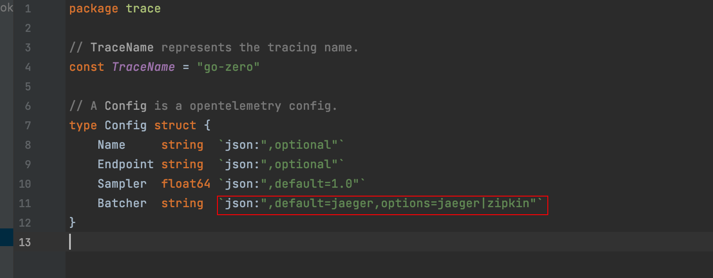
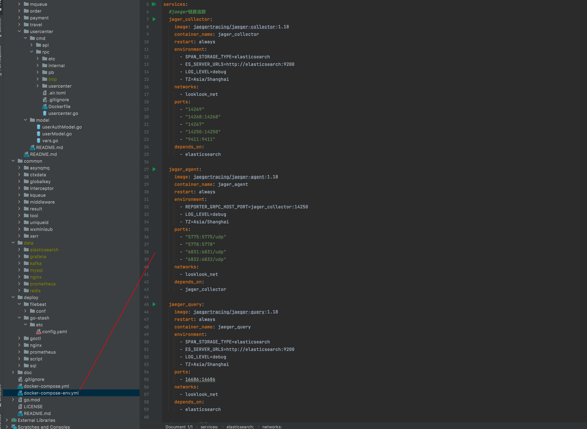
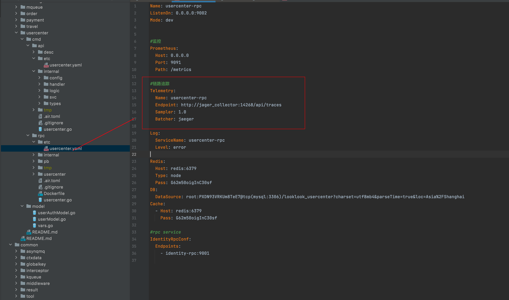

### 12、链路追踪

#### 1、概述

如果按照我前两节错误处理、日志收集配置的话，我们通过日志中的traceId也可以完整看到报错时候的整体链路日志，但是不报错的时候或者想方便的查看单个业务整个链路调用的执行时间是不太方便查看的，所以最好还是加上链路追踪。

go-zero底层已经帮我们把代码跟链路追踪对接的代码已经写好了

默认支持jaeger、zinpink

我们只需要在我们的业务代码配置中，也就是你的业务配置的yaml中配置参数即可。

#### 2、实现

go-zero-looklook是以jaeger来实现的

##### 2.1 jaeger

项目的docker-compose-env.yaml中配置了jaeger

配置

jager_collector
jager_agent
jaeger_query

其中jager_collector 依赖elasticsearch做存储，所以要把elasticsearch安装上，前一节收集日志时候我们已经演示了。

##### 2.2 业务配置

我们以用户服务为例

1）api配置

app/usercenter/cmd/api/etc/usercenter.yaml

2）rpc配置

##### 2.3 查看链路

请求用户服务注册、登陆、获取登陆用户信息

浏览器输入 http://127.0.0.1:16686/search即可查看

#### 3、结尾

日志、链路追踪我们都整理完了，好的系统一定能及时监控异常，接下来要看服务监控了。

