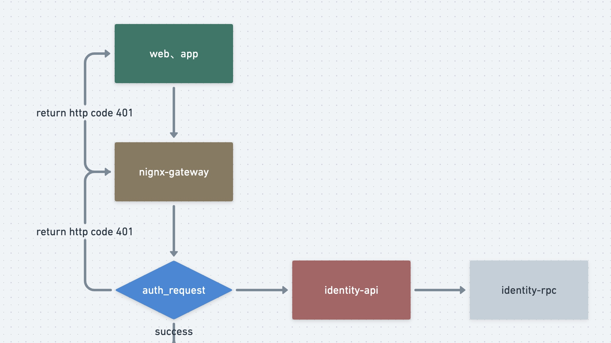

### 一、使用nginx做网关

本项目地址 :  https://github.com/Mikaelemmmm/go-zero-looklook


#### 1、go-zero网关概念

go-zero架构往大的说主要有2部分组成，一个是api，一个是rpc。api主要是http对外访问的，rpc主要就是内部业务交互使用的是protobuf+grpc，当我们项目体量还不大的时候，我们可以使用api来做一个单体项目，等后续量上来之后，可以拆分到rpc做微服务，从单体转向微服务十分容易，很像java的springboot转像springcloud，非常方便。

api被很多同学理解成了网关，实际意义上来说当你的项目在使用go-zero做微服务时候，你把api当成网关也没什么大的问题，不过这样做导致的问题就是一个api对应后面多个rpc，api充当了网关，这样如果我在更新后续业务代码时候，更新任何业务都要去改动这个api网关，比如我只是改了一个小小的不起眼的服务，那就要重新构建整个api，这样不太合理，效率极低也很不方便。所以，我们只是把api当成一个聚合服务，可以拆分成多个api，比如用户服务有用户服务的rpc与api，订单服务，有订单服务的rpc与api，这样当我修改用户服务时候，我只需要更新用户的rpc与api，所有的api只是用来聚合后端rpc的业务。那有的同学就会说，我总不能每个服务解析个域名对应你的api吧，当然不能，这时候api前面就要有一个网关了，这个网关才是真正意义上的网关，比如我们常说的nginx、kong、apisix，很多微服务都内置了网关，比如springcloud提供了springcloud-gateway ， go-zero没有提供，实际也用不着单独去写一个网关，市面上的网关已经够多了，go-zero官方在晓黑板中用的nginx足够用了，当然你如果更熟悉kong、apisix都可以替换，本质上没什么不一样的，只是一个统一流量入口，统一鉴权等。


#### 2、nginx网关

【注】：在看这里的时候，建议先看一下前一节的业务架构图



本项目中实际也使用了nginx做为网关，使用nginx的auth_request模块作为统一鉴权，业务内部不做鉴权（设计到资产的最好业务内部做二次鉴权，主要多一层安全），nignx的网关配置在项目的data/nginx/conf.d/looklook-gateway.conf

```conf
server{
    listen 8081;
    access_log /var/log/nginx/looklook.com_access.log;
    error_log /var/log/nginx//looklook.com_error.log;

    location /auth {
	    internal;
      proxy_set_header X-Original-URI $request_uri;
	    proxy_pass_request_body off;
	    proxy_set_header Content-Length "";
	    proxy_pass http://identity-api:8001/identity/v1/verify/token;
    }

    location ~ /usercenter/ {
       auth_request /auth;
       auth_request_set $user $upstream_http_x_user;
       proxy_set_header x-user $user;

       proxy_set_header Host $http_host;
       proxy_set_header X-Real-IP $remote_addr;
       proxy_set_header REMOTE-HOST $remote_addr;
       proxy_set_header X-Forwarded-For $proxy_add_x_forwarded_for;
       proxy_pass http://usercenter-api:8002;
   }

   location ~ /travel/ {
       auth_request /auth;
       auth_request_set $user $upstream_http_x_user;
       proxy_set_header x-user $user;

       proxy_set_header Host $http_host;
       proxy_set_header X-Real-IP $remote_addr;
       proxy_set_header REMOTE-HOST $remote_addr;
       proxy_set_header X-Forwarded-For $proxy_add_x_forwarded_for;
       proxy_pass http://travel-api:8003;
   }


    location ~ /order/ {
       auth_request /auth;
       auth_request_set $user $upstream_http_x_user;
       proxy_set_header x-user $user;

       proxy_set_header Host $http_host;
       proxy_set_header X-Real-IP $remote_addr;
       proxy_set_header REMOTE-HOST $remote_addr;
       proxy_set_header X-Forwarded-For $proxy_add_x_forwarded_for;
       proxy_pass http://order-api:8004;
   }

    location ~ /payment/ {
       auth_request /auth;
       auth_request_set $user $upstream_http_x_user;
       proxy_set_header x-user $user;

       proxy_set_header Host $http_host;
       proxy_set_header X-Real-IP $remote_addr;
       proxy_set_header REMOTE-HOST $remote_addr;
       proxy_set_header X-Forwarded-For $proxy_add_x_forwarded_for;
       proxy_pass http://payment-api:8005;
   }
}
```

容器内部nginx端口是8081，使用docker暴露出去8888映射端口8081，这样外部通过8888来访问网关，使用location来匹配每个服务，当然会有人说，没加一个api服务都要来nignx配置太麻烦，你也可以使用confd统一配置，自行百度。


#### 3、举例

当我们在访问用户服务时候, http://127.0.0.1:8888/usercenter/v1/user/detail , 访问了外部端口8888，然后映射到nginx内部looklook网关8081上，然后location匹配到了/usercenter/ ，在该模块开始有一行 auth_request /auth， 所以nginx不会直接去请求http://usercenter-api:8002 ， 而是会先跳到 location /auth 模块中，auth模块会访问 http://identity-api:8001/identity/v1/verify/token; ,identity-api也是我们内部的服务，是由我们自己写的鉴权服务，实际也是用的go-zero的jwt

进入identity-api 只做了2件事情（具体可以看looklook项目中的identity-api代码）

1、判断当前访问的路由（usercenter/v1/user/detail ）是否需要登陆

​	这里的路由是否需要登陆，可以在identity-api中配置，代码已经实现好了

​	


2、解析传递的token到header中

- 如果当前访问的路由需要登陆：

  - token解析失败：就会返回给前端http401错误码；

  - token解析成功：就会将解析出来的userId放入header的x-user中返回给auth模块，auth模块会把header传递给对应访问的服务（usercenter）, 这样我们在usercenter直接就可以拿到该登陆用户的id了

- 如果当前访问的路由不需要登陆：

  - 前端header中传递了token
    - 如果token校验失败：返回http401；
    - 如果token校验成功：就会将解析出来的userId放入header的x-user中返回给auth模块，auth模块会把header传递给对应访问的服务（usercenter）, 这样我们在usercenter直接就可以拿到该登陆用户的id了

  - 前段header中没传递token：userid 会传递 0 给后端服务


#### 4、总结

这样我们就可以统一入口，统一鉴权，也可以统一收集日志上报，用作错误分析，或者访问用户的行为分析。因为我们日常对nginx用的比较多，也比较熟悉，如果各位同学对kong、apisix比较熟悉，在了解了上方go-zero使用网关的概念就可以直接替换也是一样的。


