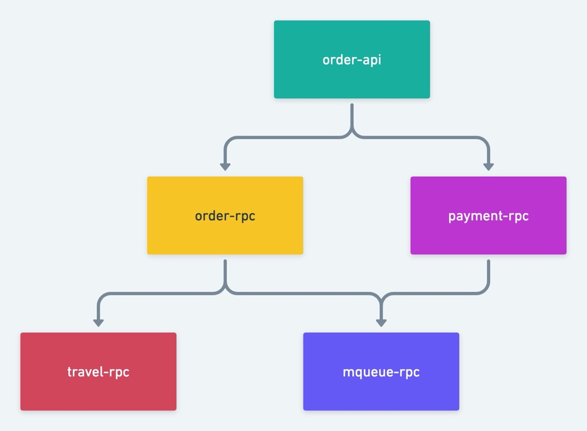
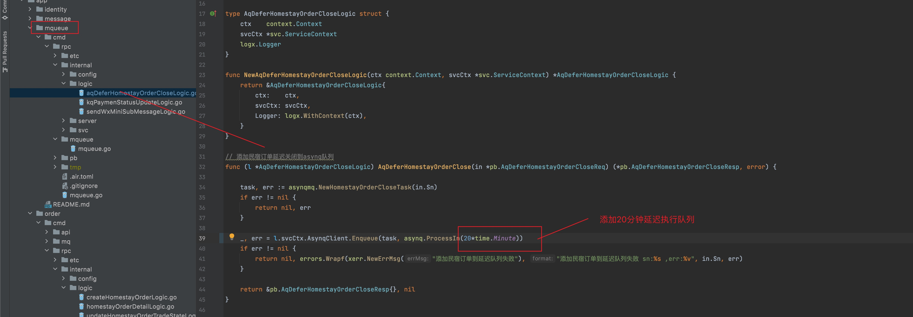
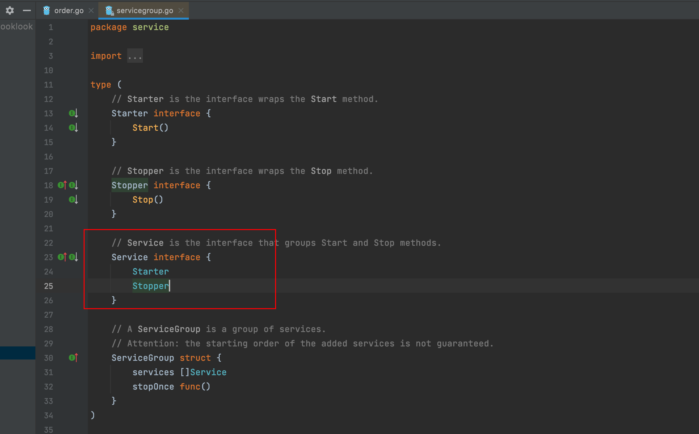
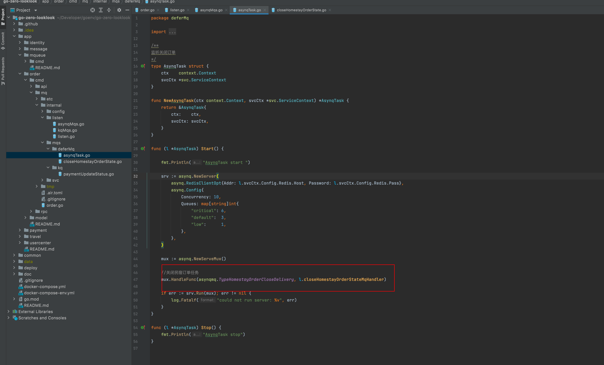

### 四、订单服务

本项目地址 :  https://github.com/Mikaelemmmm/go-zero-looklook


#### 1、订单服务业务架构图




#### 2、依赖关系

order-api（订单api） 依赖 order-rpc（订单rpc）、payment-rpc（支付rpc）

payment-rpc（支付rpc） 依赖 mqueue-rpc(消息队列)

order-rpc（订单rpc） 依赖 mqueue-rpc(消息队列)、travel-rpc（民宿rpc）


#### 3、订单举例

##### 3.1 下订单

1、用户在去浏览travel服务中的民宿homestay看中选择日期之后要下单，调用下单api接口

app/order/cmd/api/desc/order.api

```protobuf
//订单模块v1版本的接口
@server(
   prefix: order/v1
   group: homestayOrder
)
service order {
   
   @doc "创建民宿订单"
   @handler createHomestayOrder
   post /homestayOrder/createHomestayOrder (CreateHomestayOrderReq) returns (CreateHomestayOrderResp)
   
   .....
}
```


2、order-api中调用order-rpc


3、rpc中校验条件创建订单之后 ，**会调用mqueue-rpc创建一个延迟关闭订单的消息队列**


4、mqueue-rpc 延迟队列中的代码 ,延迟队列是用的asynq，asynq是基于redis的高性能队列，同时支持消息队列、定时队列、固定周期队列，但是我们这个项目为了演示go-zero官方的消息队列go-queue（go-queue是基于kafka的），所以消息队列用的go-queue，延迟队列、定时任务用asynq。这里注意，这里只是往延迟队列添加延迟任务，具体执行不再这里，那我们去看看20分钟之后具体执行的代码，在app/order/cmd/mq



5、我们再来看看具体执行20分之后的延迟对列，在app/order/cmd/mq，这里我要说明一下，go-zero官方goctl支持生成的服务目前是api、rpc，目前暂时还没有支持console、mq等，但是go-zero提供了serviceGroup，方便我们管理我们自己任何的服务，所以在mq中我是用了serviceGroup管理了服务，这也是官方推荐的使用方式，代码如下:


1）app/order/cmd/mq/order.go 首先我们看main.go

```go
func main() {
	flag.Parse()
	var c config.Config

	conf.MustLoad(*configFile, &c)
  
	// log、prometheus、trace、metricsUrl.
	if err := c.SetUp(); err != nil {
		panic(err)
	}

	serviceGroup := service.NewServiceGroup()
	defer serviceGroup.Stop()

	for _, mq := range listen.Mqs(c) {
		serviceGroup.Add(mq)
	}
	serviceGroup.Start()
}
```

serviceGroup可以添加任何service进去，但是如何成为一个service呢？ 那你就要实现两个方法一个Starter、一个Stoper



2）我们在main中可以看到循环listen.Mqs(c)  ，那我们看看listen.Mqs(c) 都有哪些


我们不止要监听asynq的延迟队列、定时队列，后面我们还想监听go-queue的kafka消息队列，在代码上我们考虑不想把go-queue的kafka消息队列跟asynq的延迟队列、定时队列放到一起去，所以这里做了个分类

3）asyny的延迟消息队列

定义asynq


定义路由



具体实现逻辑（关闭订单逻辑）


所以我们启动这个order-mq的时候，asynq就会被加载、定义路由，当我们之前添加的延迟队列到了20分钟，就会自动执行关闭订单逻辑，如果订单没有被支付，这里就会关闭掉订单，支付了就忽略掉了，这样就可以不用使用定时任务轮训关闭订单了，哈哈


##### 3.2 订单列表

没啥逻辑，就是查出来显示罢了，自己看一下就好了

```protobuf
//订单模块v1版本的接口
@server(
   prefix: order/v1
   group: homestayOrder
)
service order {

   @doc "用户订单列表"
   @handler userHomestayOrderList
   post /homestayOrder/userHomestayOrderList (UserHomestayOrderListReq) returns (UserHomestayOrderListResp)
   
}
```


##### 3.3 订单明细

没啥逻辑，就是查出来显示罢了，自己看一下就好了

```protobuf
//订单模块v1版本的接口
@server(
	prefix: order/v1
	group: homestayOrder
)
service order {

	@doc "用户订单明细"
	@handler userHomestayOrderDetail
	post /homestayOrder/userHomestayOrderDetail (UserHomestayOrderDetailReq) returns (UserHomestayOrderDetailResp)
}
```


#### 4、结尾

下了订单，当然我们要支付了，那就看下一篇支付服务吧


