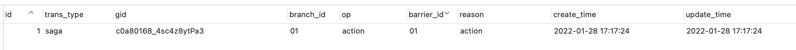
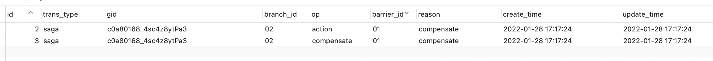

### 九、分布式事务

因为本项目服务划分相对独立一些，所以目前没有使用到分布式事务，不过go-zero结合dtm使用分布式事务的最佳实践，我有整理demo，这里就介绍一下go-zero结合dtm的使用，项目地址go-zero结合dtm最佳实践仓库地址 ： https://github.com/Mikaelemmmm/gozerodtm

【注】下面说的不是go-zero-looklook项目，是这个项目 https://github.com/Mikaelemmmm/gozerodtm


#### 一、首先需要注意

##### go-zero 1.2.4版本以上，这个一定要注意

##### dtm 你用最新的就行了


#### 二、clone dtm

```shell
git clone https://github.com/yedf/dtm.git
```


#### 三、配置文件

1、找到项目跟文件夹下的conf.sample.yml

2、cp conf.sample.yml   conf.yml

3、使用etcd ， 把配置中下面这段注释打开  （如果没用etcd就更简单了 ，这个都省了，直接链接到dtm server地址就可以了）

```yaml
MicroService:
 Driver: 'dtm-driver-gozero' # name of the driver to handle register/discover
 Target: 'etcd://localhost:2379/dtmservice' # register dtm server to this url
 EndPoint: 'localhost:36790'
```

 解释一下：

MicroService 这个不要动，这个代表要对把dtm注册到那个微服务服务集群里面去，使微服务集群内部服务可以通过grpc直接跟dtm交互

Driver ：'dtm-driver-gozero' ，  使用go-zero的注册服务发现驱动，支持go-zero

Target: 'etcd://localhost:2379/dtmservice'  将当前dtm的server直接注册到微服务所在的etcd集群中，如果go-zero作为微服务使用的话，就可以直接通过etcd拿到dtm的server grpc链接，直接就可以跟dtm server交互了

 EndPoint: 'localhost:36790' ， 代表的是dtm的server的连接地址+端口 ， 集群中的微服务可以直接通过etcd获得此地址跟dtm交互了，

如果你自己去改了dtm源码grpc端口，记得这里要改下端口


#### 四、启动dtm server

在dtm项目根目录下

```shell
go run app/main.go dev
```


#### 五、使用go-zero的grpc对接dtm

这是一个快速下单扣商品库存的例子

##### 1、order-api

order-api是http服务入口创建订单

```go
service order {
   @doc "创建订单"
   @handler create
   post /order/quickCreate (QuickCreateReq) returns (QuickCreateResp)
}
```

接下来看logic

```go
func (l *CreateLogic) Create(req types.QuickCreateReq,r *http.Request) (*types.QuickCreateResp, error) {

	orderRpcBusiServer, err := l.svcCtx.Config.OrderRpcConf.BuildTarget()
	if err != nil{
		return nil,fmt.Errorf("下单异常超时")
	}
	stockRpcBusiServer, err := l.svcCtx.Config.StockRpcConf.BuildTarget()
	if err != nil{
		return nil,fmt.Errorf("下单异常超时")
	}

	createOrderReq:= &order.CreateReq{UserId: req.UserId,GoodsId: req.GoodsId,Num: req.Num}
	deductReq:= &stock.DecuctReq{GoodsId: req.GoodsId,Num: req.Num}

	//这里只举了saga例子，tcc等其他例子基本没啥区别具体可以看dtm官网

	gid := dtmgrpc.MustGenGid(dtmServer)
	saga := dtmgrpc.NewSagaGrpc(dtmServer, gid).
		Add(orderRpcBusiServer+"/pb.order/create", orderRpcBusiServer+"/pb.order/createRollback", createOrderReq).
		Add(stockRpcBusiServer+"/pb.stock/deduct", stockRpcBusiServer+"/pb.stock/deductRollback", deductReq)

	err = saga.Submit()
	dtmimp.FatalIfError(err)
	if err != nil{
		return nil,fmt.Errorf("submit data to  dtm-server err  : %+v \n",err)
	}

	return &types.QuickCreateResp{}, nil
}
```

进入到下单逻辑时，分别获取order订单、stock库存服务的rpc在etcd中的地址，使用BuildTarget()这个方法

然后创建order、stock对应的请求参数

请求dtm获取全局事务id ， 基于此全局事务id开启grpc的saga分布式事务 ，将创建订单、扣减库存请求放入事务中，这里使用grpc形式请求，每个业务要有一个正向请求、一个回滚请求、以及请求参数，当执行其中任何一个业务正向请求出错了会自动调用事务中所有业务回滚请求达到回滚效果。


##### 2、order-srv

order-srv是订单的rpc服务，与dtm-gozero-order数据库中order表交互

```protobuf
//service
service order {
   rpc create(CreateReq)returns(CreateResp);
   rpc createRollback(CreateReq)returns(CreateResp);
}
```


###### 2.1 Create

当order-api提交事务默认请求的是create方法，我们看看logic

```go
func (l *CreateLogic) Create(in *pb.CreateReq) (*pb.CreateResp, error) {

   fmt.Printf("创建订单 in : %+v \n", in)

   //barrier防止空补偿、空悬挂等具体看dtm官网即可，别忘记加barrier表在当前库中，因为判断补偿与要执行的sql一起本地事务
   barrier, err := dtmgrpc.BarrierFromGrpc(l.ctx)
   db, err := sqlx.NewMysql(l.svcCtx.Config.DB.DataSource).RawDB()
   if err != nil {
      //!!!一般数据库不会错误不需要dtm回滚，就让他一直重试，这时候就不要返回codes.Aborted, dtmcli.ResultFailure 就可以了，具体自己把控!!!
      return nil, status.Error(codes.Internal, err.Error())
   }
   if err := barrier.CallWithDB(db, func(tx *sql.Tx) error {

      order := new(model.Order)
      order.GoodsId = in.GoodsId
      order.Num = in.Num
      order.UserId = in.UserId

      _, err = l.svcCtx.OrderModel.Insert(tx, order)
      if err != nil {
         return fmt.Errorf("创建订单失败 err : %v , order:%+v \n", err, order)
      }

      return nil
   }); err != nil {
      //!!!一般数据库不会错误不需要dtm回滚，就让他一直重试，这时候就不要返回codes.Aborted, dtmcli.ResultFailure 就可以了，具体自己把控!!!
      return nil, status.Error(codes.Internal, err.Error())
   }

   return &pb.CreateResp{}, nil
}
```

可以看到，一进入方法内部我们就使用了dtm的子事务屏障技术，至于为什么使用子事务屏障是因为可能会出现重复请求或者空请求造成的脏数据等，在这里dtm自动给我们做了幂等处理不需要我们自己在额外做了，同时保证他内部的幂等处理跟我们自己执行的事务要在一个事务中，所以要使用一个会话的db链接，这时候我们就要先获取

```go
   db, err := sqlx.NewMysql(l.svcCtx.Config.DB.DataSource).RawDB()
```

然后基于此db连接dtm在内部通过sql执行做幂等处理，同时我们基于此db连接开启事务，这样就能保证dtm内部的子事务屏障在执行sql操作与我们自己业务执行的sql操作在一个事务中。

dtm在使用grpc调用我们业务的时候，我们的grpc服务在返回给dtm server错误时候，dtm会根据我们返回给它的grpc错误码判断是要执行回滚操作还是一直重试：

- codes.Internal ： dtm server不会调用回滚，会一直重试，每次重试dtm的数据库中都会加一次重试次数，自己可以监控这个重试次数报警，人工处理
- codes.Aborted :    dtm server会调用所有回滚请求，执行回滚操作

如果dtm在调用grpc返回错误是nil时候，就认为调用成功了


###### 2.2 CreateRollback

当我们调用订单的创建订单或者库存扣减时候返回给dtm server 的codes.Aborted时候，dtm server会调用所有回滚操作，CreateRollback就是对应订单下单的回滚操作，代码如下

```go
func (l *CreateRollbackLogic) CreateRollback(in *pb.CreateReq) (*pb.CreateResp, error) {

	fmt.Printf("订单回滚  , in: %+v \n", in)

	order, err := l.svcCtx.OrderModel.FindLastOneByUserIdGoodsId(in.UserId, in.GoodsId)
	if err != nil && err != model.ErrNotFound {
		//!!!一般数据库不会错误不需要dtm回滚，就让他一直重试，这时候就不要返回codes.Aborted, dtmcli.ResultFailure 就可以了，具体自己把控!!!
		return nil, status.Error(codes.Internal, err.Error())
	}

	if order != nil {

		barrier, err := dtmgrpc.BarrierFromGrpc(l.ctx)
		db, err := l.svcCtx.OrderModel.SqlDB()
		if err != nil {
			//!!!一般数据库不会错误不需要dtm回滚，就让他一直重试，这时候就不要返回codes.Aborted, dtmcli.ResultFailure 就可以了，具体自己把控!!!
			return nil, status.Error(codes.Internal, err.Error())
		}
		if err := barrier.CallWithDB(db, func(tx *sql.Tx) error {

			order.RowState = -1
			if err := l.svcCtx.OrderModel.Update(tx, order); err != nil {
				return fmt.Errorf("回滚订单失败  err : %v , userId:%d , goodsId:%d", err, in.UserId, in.GoodsId)
			}

			return nil
		}); err != nil {
			logx.Errorf("err : %v \n", err)

			//!!!一般数据库不会错误不需要dtm回滚，就让他一直重试，这时候就不要返回codes.Aborted, dtmcli.ResultFailure 就可以了，具体自己把控!!!
			return nil, status.Error(codes.Internal, err.Error())
		}

	}
	return &pb.CreateResp{}, nil
}

```

其实就是如果之前下单成功了，将之前下成功的单给取消掉就是对应下单的回滚操作

##### 3、stock-srv

###### 3.1 Deduct

扣减库存，这里跟order的Create一样了，是下单事务内的正向操作，扣减库存，代码如下

```go
func (l *DeductLogic) Deduct(in *pb.DecuctReq) (*pb.DeductResp, error) {

	fmt.Printf("扣库存start....")

	stock, err := l.svcCtx.StockModel.FindOneByGoodsId(in.GoodsId)
	if err != nil && err != model.ErrNotFound {
		//!!!一般数据库不会错误不需要dtm回滚，就让他一直重试，这时候就不要返回codes.Aborted, dtmcli.ResultFailure 就可以了，具体自己把控!!!
		return nil, status.Error(codes.Internal, err.Error())
	}
	if stock == nil || stock.Num < in.Num {
		//【回滚】库存不足确定需要dtm直接回滚，直接返回 codes.Aborted, dtmcli.ResultFailure 才可以回滚
		return nil, status.Error(codes.Aborted, dtmcli.ResultFailure)
	}

	//barrier防止空补偿、空悬挂等具体看dtm官网即可，别忘记加barrier表在当前库中，因为判断补偿与要执行的sql一起本地事务
	barrier, err := dtmgrpc.BarrierFromGrpc(l.ctx)
	db, err := l.svcCtx.StockModel.SqlDB()
	if err != nil {
		//!!!一般数据库不会错误不需要dtm回滚，就让他一直重试，这时候就不要返回codes.Aborted, dtmcli.ResultFailure 就可以了，具体自己把控!!!
		return nil, status.Error(codes.Internal, err.Error())
	}
	if err := barrier.CallWithDB(db, func(tx *sql.Tx) error {
		sqlResult,err := l.svcCtx.StockModel.DecuctStock(tx, in.GoodsId, in.Num)
		if err != nil{
			//!!!一般数据库不会错误不需要dtm回滚，就让他一直重试，这时候就不要返回codes.Aborted, dtmcli.ResultFailure 就可以了，具体自己把控!!!
			return status.Error(codes.Internal, err.Error())
		}
		affected, err := sqlResult.RowsAffected()
		if err != nil{
			//!!!一般数据库不会错误不需要dtm回滚，就让他一直重试，这时候就不要返回codes.Aborted, dtmcli.ResultFailure 就可以了，具体自己把控!!!
			return status.Error(codes.Internal, err.Error())
		}

		//如果是影响行数为0，直接就告诉dtm失败不需要重试了
		if affected <= 0 {
			return  status.Error(codes.Aborted,  dtmcli.ResultFailure)
		}

		//！！开启测试！！ ： 测试订单回滚更改状态为失效，并且当前库扣失败不需要回滚
		//return fmt.Errorf("扣库存失败 err : %v , in:%+v \n",err,in)

		return nil
	}); err != nil {
		//!!!一般数据库不会错误不需要dtm回滚，就让他一直重试，这时候就不要返回codes.Aborted, dtmcli.ResultFailure 就可以了，具体自己把控!!!
		return nil,err
	}

	return &pb.DeductResp{}, nil
}

```

这里值得注意的是当只有库存不足、或者在扣库存影响行数为0（未成功）才需要告诉dtm server要回滚，其他情况下其实都是网络抖动、硬件异常导致，应该让dtm server一直重试，当然自己要加个最大重试次数的监控报警，如果达到最大次数还未成功能实现自动发短信、打电话人工介入了。


###### 3.2 DeductRollback

这里是对应扣库存的回滚操作

```go
func (l *DeductRollbackLogic) DeductRollback(in *pb.DecuctReq) (*pb.DeductResp, error) {

	fmt.Printf("库存回滚 in : %+v \n", in)

	barrier, err := dtmgrpc.BarrierFromGrpc(l.ctx)
	db, err := l.svcCtx.StockModel.SqlDB()
	if err != nil {
		//!!!一般数据库不会错误不需要dtm回滚，就让他一直重试，这时候就不要返回codes.Aborted, dtmcli.ResultFailure 就可以了，具体自己把控!!!
		return nil, status.Error(codes.Internal, err.Error())
	}
	if err := barrier.CallWithDB(db, func(tx *sql.Tx) error {
		if err := l.svcCtx.StockModel.AddStock(tx, in.GoodsId, in.Num); err != nil {
			return fmt.Errorf("回滚库存失败 err : %v ,goodsId:%d , num :%d", err, in.GoodsId, in.Num)
		}
		return nil
	}); err != nil {
		logx.Errorf("err : %v \n", err)
		//!!!一般数据库不会错误不需要dtm回滚，就让他一直重试，这时候就不要返回codes.Aborted, dtmcli.ResultFailure 就可以了，具体自己把控!!!
		return nil, status.Error(codes.Internal, err.Error())
	}

	return &pb.DeductResp{}, nil
}

```


### 六、子事务屏障

这个词是dtm作者定义的，其实子事务屏障代码不多，看barrier.CallWithDB这个方法即可。

```go
// CallWithDB the same as Call, but with *sql.DB
func (bb *BranchBarrier) CallWithDB(db *sql.DB, busiCall BarrierBusiFunc) error {   
  tx, err := db.Begin()   
  if err != nil {      
    return err   
  }   
  return bb.Call(tx, busiCall)
}
```

由于这个方法他在内部开启本地事务，它内部是在此事务执行了sql操作，所以在我们执行自己的业务时候必须跟它用同一个事务，那就要基于同一个db连接开事务了，so~ 你知道为什么我们要提前获取db连接了吧，目的就是要让它内部执行的sql操作跟我们的sql操作在一个事务下。至于它内部为什么执行自己的sql操作，接下来我们分析。

我们看bb.Call这个方法

```go
// Call 子事务屏障，详细介绍见 https://zhuanlan.zhihu.com/p/388444465
// tx: 本地数据库的事务对象，允许子事务屏障进行事务操作
// busiCall: 业务函数，仅在必要时被调用
func (bb *BranchBarrier) Call(tx *sql.Tx, busiCall BarrierBusiFunc) (rerr error) {
 bb.BarrierID = bb.BarrierID + 1
 bid := fmt.Sprintf("%02d", bb.BarrierID)
 defer func() {
  // Logf("barrier call error is %v", rerr)
  if x := recover(); x != nil {
   tx.Rollback()
   panic(x)
  } else if rerr != nil {
   tx.Rollback()
  } else {
   tx.Commit()
  }
 }()
 ti := bb
 originType := map[string]string{
  BranchCancel:     BranchTry,
  BranchCompensate: BranchAction,
 }[ti.Op]

 originAffected, _ := insertBarrier(tx, ti.TransType, ti.Gid, ti.BranchID, originType, bid, ti.Op)
 currentAffected, rerr := insertBarrier(tx, ti.TransType, ti.Gid, ti.BranchID, ti.Op, bid, ti.Op)
 dtmimp.Logf("originAffected: %d currentAffected: %d", originAffected, currentAffected)
 if (ti.Op == BranchCancel || ti.Op == BranchCompensate) && originAffected > 0 || // 这个是空补偿
  currentAffected == 0 { // 这个是重复请求或者悬挂
  return
 }
 rerr = busiCall(tx)
 return
}
```

核心其实就是如下几行代码

```go
originAffected, _ := insertBarrier(tx, ti.TransType, ti.Gid, ti.BranchID, originType, bid, ti.Op)	
currentAffected, rerr := insertBarrier(tx, ti.TransType, ti.Gid, ti.BranchID, ti.Op, bid, ti.Op)	
dtmimp.Logf("originAffected: %d currentAffected: %d", originAffected, currentAffected)	
if (ti.Op == BranchCancel || ti.Op == BranchCompensate) && originAffected > 0 || // 这个是空补偿		
  currentAffected == 0 { // 这个是重复请求或者悬挂		
  return	
}
rerr = busiCall(tx)
```

```go
func insertBarrier(tx DB, transType string, gid string, branchID string, op string, barrierID string, reason string) (int64, error) {	 if op == "" {		
  	return 0, nil	
	}	
                                                                                                                                     	sql := dtmimp.GetDBSpecial().GetInsertIgnoreTemplate("dtm_barrier.barrier(trans_type, gid, branch_id, op, barrier_id, reason) values(?,?,?,?,?,?)", "uniq_barrier")	
                                                                                                                                     return dtmimp.DBExec(tx, sql, transType, gid, branchID, op, barrierID, reason)                                                                                                          }
```

每一个业务逻辑，dtm server在正常成功请求时候，  ti.Op 默认正常执行的操作是action，所以正常第一次请求都是ti.Op值都是action，那originType就是“” 

```go
	originAffected, _ := insertBarrier(tx, ti.TransType, ti.Gid, ti.BranchID, originType, bid, ti.Op)
```

那么上面这个sql就不会执行因为ti.Op == "" 在insertBarrier中直接return了

```go
	currentAffected, rerr := insertBarrier(tx, ti.TransType, ti.Gid, ti.BranchID, ti.Op, bid, ti.Op)
```

那第二个sql的ti.Op是 action， 所以子事务屏障表barrier就会插入一条数据

同理在执行库存也会插入一条 

#### 1、整个事务都成功的子事务屏障

那在一次下订单正常成功请求下，由于 ti.Op都是action，所以originType都是"" , 所以不管是下单的barrier 还是扣库存的barrier，在执行他们2次barrier insert时候，originAffected都会忽略，因为originType==“” 会直接被return不插入数据，这样看来 不管是下单还是扣库存，barrier的第二条插入数据生效，所以barrier数据表中就会有2条下单数据，一条是订单的一条是扣库存的


gid  : dtm全局事务id

branch_id : 每个全局事务id下的每个业务id

op : 操作，如果是正常成功请求就是action

barrier_id : 同一个业务下开多个会递增

这4个字段在表中是联合唯一索隐，在insertBarrier时候，dtm判断如果存在就忽略不插入

#### 2、如果订单成功库存不足回滚子事务屏障

我们库存只有10个 ，我们下单20个

1）当订单下成功，因为订单下单时候并不知道后续库存情况（即时在下单时候先去查库存那也会有查询时候足够，扣除时候不足情况），

所以下单成功barrier表中按照之前梳理的逻辑就会在barrier表中产生一条正确数据执行数据



2）接着执行扣库存操作

```go

func (l *DeductLogic) Deduct(in *pb.DecuctReq) (*pb.DeductResp, error) {

	fmt.Printf("扣库存start....")

	stock, err := l.svcCtx.StockModel.FindOneByGoodsId(in.GoodsId)
	if err != nil && err != model.ErrNotFound {
		//!!!一般数据库不会错误不需要dtm回滚，就让他一直重试，这时候就不要返回codes.Aborted, dtmcli.ResultFailure 就可以了，具体自己把控!!!
		return nil, status.Error(codes.Internal, err.Error())
	}
	if stock == nil || stock.Num < in.Num {
		//【回滚】库存不足确定需要dtm直接回滚，直接返回 codes.Aborted, dtmcli.ResultFailure 才可以回滚
		return nil, status.Error(codes.Aborted, dtmcli.ResultFailure)
	}
  
  .......
}
```

在执行扣库存业务逻辑之前，由于我们查询库存发现库存不足，所以直接return codes.Aborted 了，不会走到子事务屏障barrier这里，所以barrier表中不会插入数据，而是告诉dtm要回滚

3）调用order回滚操作

订单回滚的时候会开启barrier，这时候又会执行barrier代码（如下），由于回滚代码的ti.Op是compensate ，orginType就是action

```go
originAffected, _ := insertBarrier(tx, ti.TransType, ti.Gid, ti.BranchID, originType, bid, ti.Op)currentAffected, rerr := insertBarrier(tx, ti.TransType, ti.Gid, ti.BranchID, ti.Op, bid, ti.Op)dtmimp.Logf("originAffected: %d currentAffected: %d", originAffected, currentAffected)
if (ti.Op == BranchCancel || ti.Op == BranchCompensate) && originAffected > 0 || // 这个是空补偿	
currentAffected == 0 { // 这个是重复请求或者悬挂	
  return
}
rerr = busiCall(tx)
```

由于我们之前下订单成功了，barrier表里有一条下单成功时候的记录action，所以originAffected==0 ，所以只会插入一条当前回滚记录继续调用 busiCall(tx) 执行后续我们自己写的回滚操作


到此，我们应该只有2条数据，一条订单成功创建记录，一条订单回滚记录


4）库存回滚DeductRollback

订单回滚成功后，会在继续调用库存回滚DeductRollback，库存回滚代码如下

这就是子事务屏障自动帮我们判断的，也就是那2条核心插入语句帮我们判断的，以至于我们业务不会出现脏数据

库存这里回滚分2中情况 

- 没扣成功回滚

- 扣成功回滚

###### 没扣成功回滚（我们当前举例场景是这个 ）

首先调用库存回滚时候ti.Op是compensate ，orginType就是action ，会执行下面2条insert

```go
originAffected, _ := insertBarrier(tx, ti.TransType, ti.Gid, ti.BranchID, originType, bid, ti.Op)currentAffected, rerr := insertBarrier(tx, ti.TransType, ti.Gid, ti.BranchID, ti.Op, bid, ti.Op)dtmimp.Logf("originAffected: %d currentAffected: %d", originAffected, currentAffected)if (ti.Op == BranchCancel || ti.Op == BranchCompensate) && originAffected > 0 || // 这个是空补偿	currentAffected == 0 { // 这个是重复请求或者悬挂	return}rerr = busiCall(tx)
```

这里结合判断如果是回滚、取消操作，originAffected > 0 当前插入成功了，之前对应的正向扣库存操作没有插入成功，说明之前库存没扣成功，直接return就不需要执行后续补偿了。所以此时会在barrier表中插入2条数据直接return，就不会执行我们后续补偿操作了



到此我们barrier表中有4条数据了


###### 扣成功回滚（这个情况自己可以尝试模拟此场景）

如果我们上一步扣库存成功，在执行此补偿的时候ti.Op是compensate ，orginType就是action ，继续执行2个insert语句

```go
originAffected, _ := insertBarrier(tx, ti.TransType, ti.Gid, ti.BranchID, originType, bid, ti.Op)currentAffected, rerr := insertBarrier(tx, ti.TransType, ti.Gid, ti.BranchID, ti.Op, bid, ti.Op)dtmimp.Logf("originAffected: %d currentAffected: %d", originAffected, currentAffected)if (ti.Op == BranchCancel || ti.Op == BranchCompensate) && originAffected > 0 || // 这个是空补偿	currentAffected == 0 { // 这个是重复请求或者悬挂	return}rerr = busiCall(tx)
```

这里结合判断如果是回滚、取消操作，originAffected == 0 当前插入忽略了没插入进去，说明之前正向扣库存插入成功了，这里只插入第二个sql语句记录即可，然后在执行后续我们补偿的业务操作。


所以，整体分析下来核心语句就是2条insert，它帮我们解决了重复回滚数据、数据幂等情况，只能说dtm作者想法真的很好，用了最少的代码帮我们解决了一个很麻烦的问题


### 七、go-zero对接中注意事项

#### 1、dtm的回滚补偿

在使用dtm的grpc时候，当我们使用saga、tcc等如果第一步尝试或者执行失败了，是希望它能执行后面的rollback的，在grpc中的服务如果发生错误了，必须返回 ： status.Error(codes.Aborted, dtmcli.ResultFailure) ， 返回其他错误，不会执行你的rollback操作，dtm会一直重试，如下：

```go
stock, err := l.svcCtx.StockModel.FindOneByGoodsId(in.GoodsId)
if err != nil && err != model.ErrNotFound {
  //!!!一般数据库不会错误不需要dtm回滚，就让他一直重试，这时候就不要返回codes.Aborted, dtmcli.ResultFailure 就可以了，具体自己把控!!!
  return nil, status.Error(codes.Internal, err.Error())
}
if stock == nil || stock.Num < in.Num {
  //【回滚】库存不足确定需要dtm直接回滚，直接返回 codes.Aborted, dtmcli.ResultFailure 才可以回滚
  return nil, status.Error(codes.Aborted, dtmcli.ResultFailure)
}
```


#### 2、barrier的空补偿、悬挂等

之前准备工作中，我们创建了dtm_barrier库以及执行了barrier.mysql.sql，这个其实就是为我们的业务服务做了一个检查，防止空补偿，具体可以看barrier.Call中源码，没几行代码可以看懂的。

如果我们线上使用的话，你的每个与db交互的服务只要用到了barrier，这个服务使用到的mysql账号，要给他分配barrier库的权限，这个不要忘记了


#### 3、barrier在rpc中本地事务

在rpc的业务中，如果使用了barrier的话，那么在model中与db交互时候必须要用事务，并且一定要跟barrier用同一个事务

logic

```go
barrier, err := dtmgrpc.BarrierFromGrpc(l.ctx)
	db, err := sqlx.NewMysql(l.svcCtx.Config.DB.DataSource).RawDB()
	if err != nil {
		//!!!一般数据库不会错误不需要dtm回滚，就让他一直重试，这时候就不要返回codes.Aborted, dtmcli.ResultFailure 就可以了，具体自己把控!!!
		return nil, status.Error(codes.Internal, err.Error())
	}
	if err := barrier.CallWithDB(db, func(tx *sql.Tx) error {
		sqlResult,err := l.svcCtx.StockModel.DecuctStock(tx, in.GoodsId, in.Num)
		if err != nil{
			//!!!一般数据库不会错误不需要dtm回滚，就让他一直重试，这时候就不要返回codes.Aborted, dtmcli.ResultFailure 就可以了，具体自己把控!!!
			return status.Error(codes.Internal, err.Error())
		}
		affected, err := sqlResult.RowsAffected()
		if err != nil{
			//!!!一般数据库不会错误不需要dtm回滚，就让他一直重试，这时候就不要返回codes.Aborted, dtmcli.ResultFailure 就可以了，具体自己把控!!!
			return status.Error(codes.Internal, err.Error())
		}

		//如果是影响行数为0，直接就告诉dtm失败不需要重试了
		if affected <= 0 {
			return  status.Error(codes.Aborted,  dtmcli.ResultFailure)
		}

		//！！开启测试！！ ： 测试订单回滚更改状态为失效，并且当前库扣失败不需要回滚
		//return fmt.Errorf("扣库存失败 err : %v , in:%+v \n",err,in)

		return nil
	}); err != nil {
		//!!!一般数据库不会错误不需要dtm回滚，就让他一直重试，这时候就不要返回codes.Aborted, dtmcli.ResultFailure 就可以了，具体自己把控!!!
		return nil,err
	}
```

model

```go
func (m *defaultStockModel) DecuctStock(tx *sql.Tx,goodsId , num int64) (sql.Result,error) {
	query := fmt.Sprintf("update %s set `num` = `num` - ? where `goods_id` = ? and num >= ?", m.table)
	return tx.Exec(query,num, goodsId,num)

}

func (m *defaultStockModel) AddStock(tx *sql.Tx,goodsId , num int64) error {
	query := fmt.Sprintf("update %s set `num` = `num` + ? where `goods_id` = ?", m.table)
	_, err :=tx.Exec(query, num, goodsId)
	return err
}
```


### 七、使用go-zero的http对接

这个基本没啥难度，grpc会了这个很简单，鉴于go在微服务中去使用http场景不多，这里就不详细去做了，我之前一个版本写过一个简单的，但是没这个完善，有兴趣可以去看下，不过那个barrier是自己基于go-zero的sqlx，将dtm的官方的做了修改，现在不需要了。

项目地址：[https://github.com/Mikaelemmmm/dtmbarrier-go-zero](https://github.com/Mikaelemmmm/dtmbarrier-go-zero)

