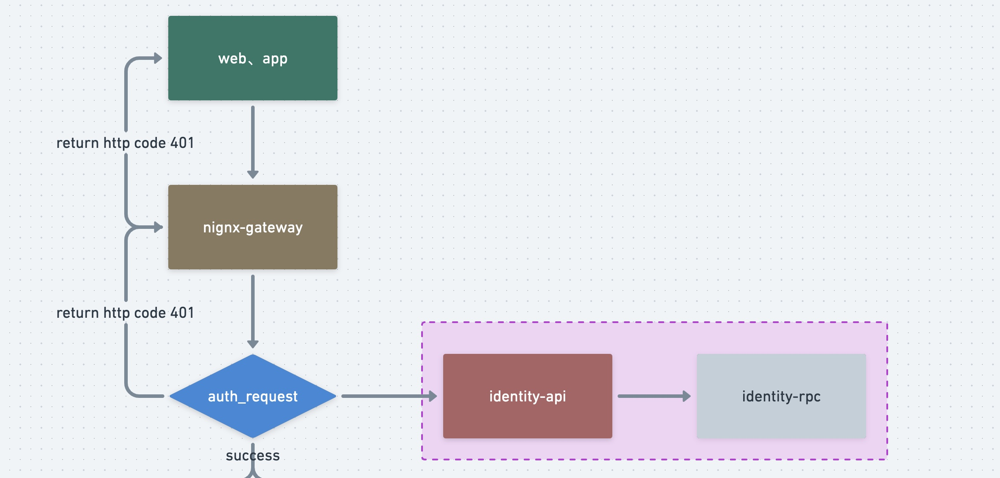
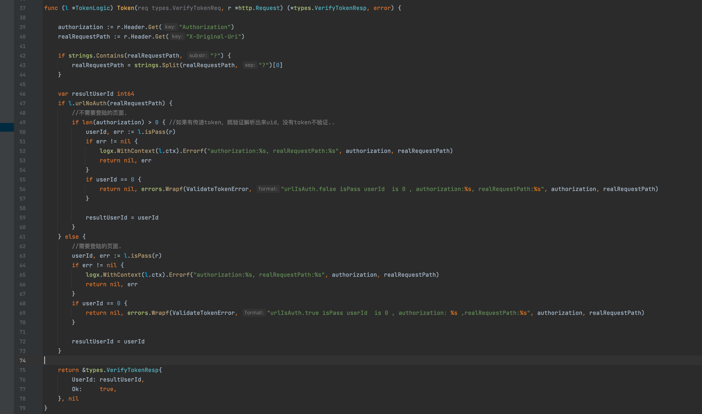

### 三、鉴权服务

本项目地址 :  https://github.com/Mikaelemmmm/go-zero-looklook


#### 1、鉴权服务




#### 1.1 identity-api

identity主要是用来做鉴权服务的，前面我们nginx网关的时候有提到。在访问一个资源的时候，nginx内部会先来identity-api中解析token，identity-api会去请求identity-rpc，所有的验证与颁发token，统一是在identity-rpc中做的




我们会从header的Authorization中获取token，从x-Original-Uri获取访问的资源路径

- 如果当前访问的路由需要登陆：

  - token解析失败：就会返回给前端http401错误码；

  - token解析成功：就会将解析出来的userId放入header的x-user中返回给auth模块，auth模块会把header传递给对应访问的服务（usercenter）, 这样我们在usercenter直接就可以拿到该登陆用户的id了

- 如果当前访问的路由不需要登陆：

  - 前端header中传递了token
    - 如果token校验失败：返回http401；
    - 如果token校验成功：就会将解析出来的userId放入header的x-user中返回给auth模块，auth模块会把header传递给对应访问的服务（usercenter）, 这样我们在usercenter直接就可以拿到该登陆用户的id了

  - 前段header中没传递token：userid 会传递 0 给后端服务


urlNoAuth方法判断当前资源是否在yml中配置可以不登陆

```go
//当前url是否需要授权验证
func (l *TokenLogic) urlNoAuth(path string) bool {
   for _, val := range l.svcCtx.Config.NoAuthUrls {
      if val == path {
         return true
      }
   }
   return false
}
```


isPass方法就是去identity-rpc校验token，主要也是使用了go-zero的jwt的方法


#### 1.2 identity-rpc

当我们在注册、登陆成功时候，用户服务会调用identity-rpc生成token，所以我们统一在identity-rpc中颁发、校验token，这样就不用每个服务都要写个jwt去维护。

当identity-api请求进来时候，identity-api自己可以解析出来userid，但是我们要检验这个token是否是过期，就要去后端rpc中的redis中去进行二次校验（当然如果你觉得这里多一次请求，你可以把这一步放到api里直接请求redis也可以），经过rpc的validateToken方法校验

```protobuf
message ValidateTokenReq {
  int64 userId = 1;
  string token = 2;
}
message ValidateTokenResp {
  bool ok = 1;
}

rpc validateToken(ValidateTokenReq) returns(ValidateTokenResp);
```

校验之前登陆、注册等授权时候颁发出去存在redis的token是否正确、过期。


这样api就可以返回给nginx的auth模块是否失败，如果失败auth会直接返回给前端http code 401（所以你们前端应该是先判断http状态码>=400全部异常，在判断业务错误码） , 如果成功直接访问后端服务了拿到数据直接返回给前端展示


#### 2、安装goctl 与 protoc、protoc-gen-go

【注】这个跟鉴权没什么关系，只是后面写代码要用到，在这里最好给安装了

1、安装goctl

```shell
# for Go 1.15 and earlier
GO111MODULE=on go get -u github.com/zeromicro/go-zero/tools/goctl@latest

# for Go 1.16 and later
go install github.com/zeromicro/go-zero/tools/goctl@latest
```

验证是否安装成功

```shell
$ goctl --version
```

Goctl自定义模版template： 将项目目录下的data/goctl文件夹内容copy到家目录的.goctl中，goctl在生成代码时候会优先根据这个模版下内容生成

```shell
$ cp -r data/goctl ~/.goctl
```


2、安装protoc

链接：https://github.com/protocolbuffers/protobuf/releases

直接找到对应平台的protoc，我是mac intel芯片，所以直接找到 protoc-3.19.3-osx-x86_64.zip ，解压出来后进入该目录下的bin目录中，将protoc直接copy到你的gopath/bin目录下即可。

验证是否安装成功

```shell
$ protoc --version
```


3、安装protoc-gen-go

```shell
$ go install google.golang.org/protobuf/cmd/protoc-gen-go@latest 
```

查看$GOPATH/bin下是否有protoc-gen-go即可

【注】：如果后续在使用goctl生成代码时候，遇到以下问题

```shell
protoc  --proto_path=/Users/seven/Developer/goenv/go-zero-looklook/app/usercenter/cmd/rpc/pb usercenter.proto --go_out=plugins=grpc:/Users/seven/Developer/goenv/go-zero-looklook/app/usercenter/cmd/rpc --go_opt=Musercenter.proto=././pb
goctl: generation error: unsupported plugin protoc-gen-go which installed from the following source:
google.golang.org/protobuf/cmd/protoc-gen-go, 
github.com/protocolbuffers/protobuf-go/cmd/protoc-gen-go;

Please replace it by the following command, we recommend to use version before v1.3.5:
go get -u github.com/golang/protobuf/protoc-gen-go
goctl version: 1.3.0 darwin/amd64
```

直接执行 

```shell
$ go get -u github.com/golang/protobuf/protoc-gen-go
```


4、安装protoc-gen-go-grpc

```shell
$ go install google.golang.org/grpc/cmd/protoc-gen-go-grpc@latest
```


### 3、总结

总的来说，identity还算是比较简单的，整个流程如下：

用户发起请求资源 -> nginx网关->匹配到对应服务模块 -> auth模块->identity-api ->identity-rpc -> 用户请求的资源


