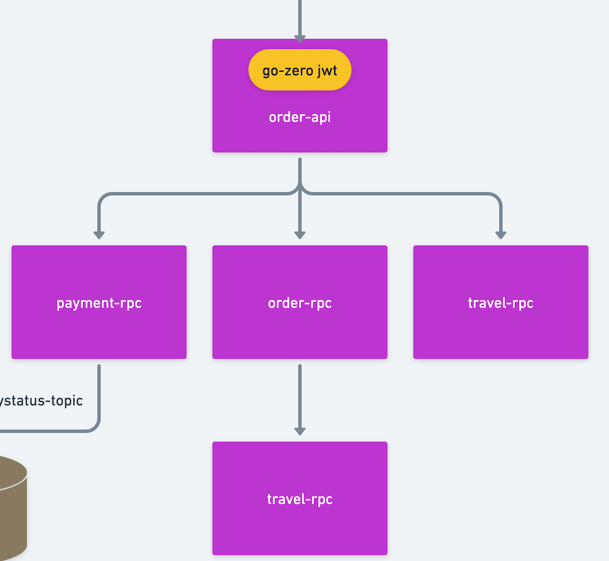
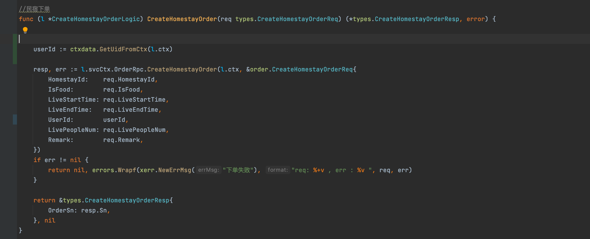

### 六、订单服务

本项目地址 :  https://github.com/Mikaelemmmm/go-zero-looklook


#### 1、订单服务业务架构图




#### 2、依赖关系

order-api（订单api） 依赖 order-rpc（订单rpc）、payment-rpc（支付rpc）、travel-rpc（民宿rpc）

order-rpc（订单rpc） 依赖 travel-rpc（民宿rpc）


#### 3、订单举例

##### 3.1 下订单

1、用户在去浏览travel服务中的民宿homestay看中选择日期之后要下单，调用下单api接口

app/order/cmd/api/desc/order.api

```protobuf
//订单模块v1版本的接口
@server(
   prefix: order/v1
   group: homestayOrder
)
service order {
   
   @doc "创建民宿订单"
   @handler createHomestayOrder
   post /homestayOrder/createHomestayOrder (CreateHomestayOrderReq) returns (CreateHomestayOrderResp)
   
   .....
}
```


2、order-api中调用order-rpc




3、rpc中校验条件创建订单之后 ，**会调用Asynq创建一个延迟关闭订单的消息队列**

go-zero-looklook/app/order/cmd/rpc/internal/logic/createHomestayOrderLogic.go

```go
// CreateHomestayOrder.
func (l *CreateHomestayOrderLogic) CreateHomestayOrder(in *pb.CreateHomestayOrderReq) (*pb.CreateHomestayOrderResp, error) {

	.....

	//2、Delayed closing of order tasks.
	payload, err := json.Marshal(jobtype.DeferCloseHomestayOrderPayload{Sn: order.Sn})
	if err != nil {
		logx.WithContext(l.ctx).Errorf("create defer close order task json Marshal fail err :%+v , sn : %s",err,order.Sn)
	}else{
		_, err = l.svcCtx.AsynqClient.Enqueue(asynq.NewTask(jobtype.DeferCloseHomestayOrder, payload), asynq.ProcessIn(CloseOrderTimeMinutes * time.Minute))
		if err != nil {
			logx.WithContext(l.ctx).Errorf("create defer close order task insert queue fail err :%+v , sn : %s",err,order.Sn)
		}
	}

	return &pb.CreateHomestayOrderResp{
		Sn: order.Sn,
	}, nil
}

```


4、go-zero-looklook/app/mqueue/cmd/job/internal/logic/closeOrder.go有定义asynq的延迟关闭订单任务

```go

// defer  close no pay homestayOrder  : if return err != nil , asynq will retry
func (l *CloseHomestayOrderHandler) ProcessTask(ctx context.Context, t *asynq.Task) error {

	var p jobtype.DeferCloseHomestayOrderPayload
	if err := json.Unmarshal(t.Payload(), &p); err != nil {
		return errors.Wrapf(ErrCloseOrderFal, "closeHomestayOrderStateMqHandler payload err:%v, payLoad:%+v", err, t.Payload())
	}

	resp, err := l.svcCtx.OrderRpc.HomestayOrderDetail(ctx, &order.HomestayOrderDetailReq{
		Sn: p.Sn,
	})
	if err != nil || resp.HomestayOrder == nil {
		return errors.Wrapf(ErrCloseOrderFal, "closeHomestayOrderStateMqHandler  get order fail or order no exists err:%v, sn:%s ,HomestayOrder : %+v", err, p.Sn, resp.HomestayOrder)
	}

	if resp.HomestayOrder.TradeState == model.HomestayOrderTradeStateWaitPay {
		_, err := l.svcCtx.OrderRpc.UpdateHomestayOrderTradeState(ctx, &order.UpdateHomestayOrderTradeStateReq{
			Sn:         p.Sn,
			TradeState: model.HomestayOrderTradeStateCancel,
		})
		if err != nil {
			return errors.Wrapf(ErrCloseOrderFal, "CloseHomestayOrderHandler close order fail  err:%v, sn:%s ", err, p.Sn)
		}
	}

	return nil
}

```

所以我们启动这个mqueue-job的时候，asynq就会被加载、定义路由，当我们之前添加的延迟队列到了20分钟，就会自动执行关闭订单逻辑，如果订单没有被支付，这里就会关闭掉订单，支付了就忽略掉了，这样就可以不用使用定时任务轮训关闭订单了，哈哈


##### 3.2 订单列表

没啥逻辑，就是查出来显示罢了，自己看一下就好了

```protobuf
//订单模块v1版本的接口
@server(
   prefix: order/v1
   group: homestayOrder
)
service order {

   @doc "用户订单列表"
   @handler userHomestayOrderList
   post /homestayOrder/userHomestayOrderList (UserHomestayOrderListReq) returns (UserHomestayOrderListResp)
   
}
```


##### 3.3 订单明细

没啥逻辑，就是查出来显示罢了，自己看一下就好了

```protobuf
//订单模块v1版本的接口
@server(
	prefix: order/v1
	group: homestayOrder
)
service order {

	@doc "用户订单明细"
	@handler userHomestayOrderDetail
	post /homestayOrder/userHomestayOrderDetail (UserHomestayOrderDetailReq) returns (UserHomestayOrderDetailResp)
}
```


#### 4、结尾

下了订单，当然我们要支付了，那就看下一篇支付服务吧


