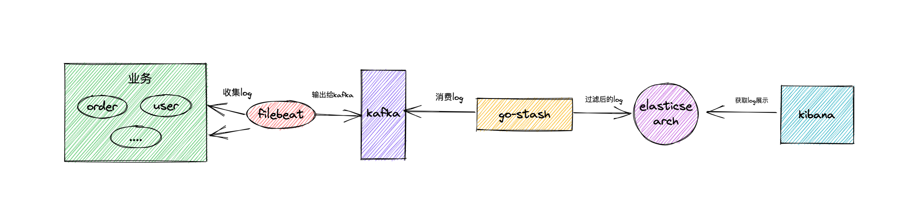
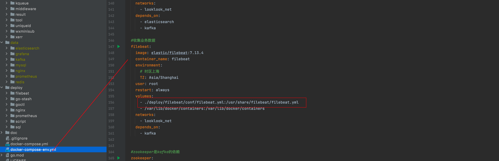
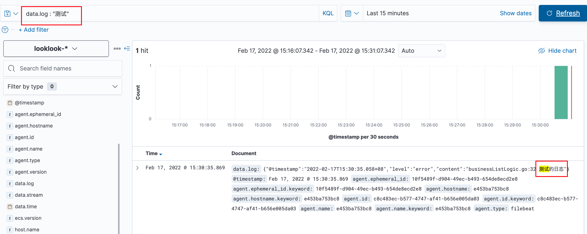

<h1>Table of Contents</h1>

- [XI. Log collection](#xi-log-collection)
  - [1. logging system](#1-logging-system)
  - [2. Architectural solutions](#2-architectural-solutions)
  - [3. Implementation options](#3-implementation-options)
    - [3.1. kafka](#31-kafka)
    - [3.2. filebeat](#32-filebeat)
    - [3.3. Configuring go-stash](#33-configuring-go-stash)
    - [3.4. elastic search.kibana](#34-elastic-searchkibana)
  - [5. Conclusion](#5-conclusion)

# XI. Log collection

Before introducing, I will first say the overall idea, if your business log volume is not particularly large coincidentally you are using cloud services, then you can directly use the cloud service logs, such as Ali cloud SLS, is basically a point of mouse configuration a few steps you can collect your logs to Ali cloud SLS inside, directly in Ali cloud to view the collected logs, it does not feel necessary Toss.

If your log volume is relatively large, then you can log system.

## 1. logging system

We will print the business logs to the console, file, after the more common way on the market is elk, efk and other basic ideas, we take the often said elk to example, the basic idea is that logstash collection filter to elasticsearch, and then kibana presents

But logstash itself is the use of java development, take up resources is really high, we use go to do business, itself in addition to fast is to take up less resources to build blocks, now in the engage a logstash waste of resources, that we use go-stash instead of logstash, go-stash is go-zero official own development and online after long time a lot of practice, but it is not responsible for collecting logs, only for filtering the information collected (<https://github.com/kevwan/go-stash>)

## 2. Architectural solutions



filebeat collects our business logs, then outputs the logs to kafka as a buffer, go-stash gets the logs in kafka to filter the fields according to the configuration, then outputs the filtered fields to elasticsearch, and finally kibana is responsible for rendering the logs

## 3. Implementation options

In the previous section on error handling, we can see that we have printed the error log we want to the console console, now we just need to do the subsequent collection

### 3.1. kafka

```yaml

  kafka:
    image: wurstmeister/kafka
    container_name: kafka
    ports:
      - 9092:9092
    environment:
      KAFKA_ADVERTISED_HOST_NAME: kafka
      KAFKA_ZOOKEEPER_CONNECT: zookeeper:2181
      TZ: Asia/Shanghai
    restart: always
    volumes:
      - /var/run/docker.sock:/var/run/docker.sock
    networks:
      - looklook_net
    depends_on:
      - zookeeper
```

⚠️  Create the topic for logging as follows: looklook-log If you have already created it when building the system development environment, you can ignore it here

First configure kafka, zookeeper

Then we go into kafka and create a filebeat to collect the logs to the kafka topic

Enter the kafka container

```shell
docker exec -it kafka /bin/sh
cd /opt/kafka/bin/
./kafka-topics.sh --create --zookeeper zookeeper:2181 --replication-factor 1 -partitions 1 --topic looklook-log
```

### 3.2. filebeat

In the docker-compose-env.yml file in the root of the project, you can see that we have configured filebeat



For the filebeat configuration we mount to deploy/filebeat/conf/filebeat.yml

```yaml
filebeat.inputs:
  - type: log
    enabled: true
    paths:
      - /var/lib/docker/containers/*/*-json.log

filebeat.config:
  modules:
    path: ${path.config}/modules.d/*.yml
    reload.enabled: false

processors:
  - add_cloud_metadata: ~
  - add_docker_metadata: ~

output.kafka:
  enabled: true
  hosts: ["kafka:9092"]
  #To create topic in advance
  topic: "looklook-log"
  partition.hash:
    reachable_only: true
  compression: gzip
  max_message_bytes: 1000000
  required_acks: 1

```

The configuration is relatively simple, you can see that we collect all the logs directly exported to our configured kafka , topic configuration can be created in the previous step kafka topic

### 3.3. Configuring go-stash


Let's look at the go-stash configuration file deploy/go-stash/etc/config.yaml

```yaml
Clusters:
  - Input:
      Kafka:
        Name: gostash
        Brokers:
          - "kafka:9092"
        Topics:
          - looklook-log
        Group: pro
        Consumers: 16
    Filters:
      - Action: drop
        Conditions:
          - Key: k8s_container_name
            Value: "-rpc"
            Type: contains
          - Key: level
            Value: info
            Type: match
            Op: and
      - Action: remove_field
        Fields:
          # - message
          - _source
          - _type
          - _score
          - _id
          - "@version"
          - topic
          - index
          - beat
          - docker_container
          - offset
          - prospector
          - source
          - stream
          - "@metadata"
      - Action: transfer
        Field: message
        Target: data
    Output:
      ElasticSearch:
        Hosts:
          - "http://elasticsearch:9200"
        Index: "looklook-{{yyyy-MM-dd}}"
```

Configure the consumed kafka and the output elasticsearch, and the fields to be filtered, etc.

### 3.4. elastic search.kibana


Go to kibana <http://127.0.0.1:5601/> and create a log index

Click on the menu in the top left corner (the three horizontal lines), find Analytics -> click on discover


Then in the current page, Create index pattern -> enter looklook-* -> Next Step -> select @timestamp -> Create index pattern

Then click the top left menu, find Analytics->click discover, wait a while, the logs are displayed (if not, go to check filebeat, go-stash, use docker logs -f filebeat to view)


Let's add an error log to the code to try it out, the code is as follows

```go
func (l *BusinessListLogic) BusinessList(req types.BusinessListReq) (*types.BusinessListResp, error) {

 logx.Error("Test log")

 ........
}
```

We access this business method by going to kibana and searching for data.log : "test", as follows



- #### 4. Common reasons for log collection failure

  - The go-stash image version is used wrongly

    Look at the go-stash log, if there is a core dumped, it means that the mirror is used wrongly.

    Solution:

    If you are mac m1 or linux arm, please change the go-stash image in docker-compose-env.yml kevinwan/go-stash:1.0-arm64, the default is linux amd

  - docker version problem
  
    Answer:
  
    This I did not actually encounter, but some students using docker version is 1.13 encountered, filebeat configuration file configuration to collect docker path low version docker may not be the same location resulting in the collection of docker internal logs, it is best to upgrade the docker18.03.1 above the current no problem, 17 did not actually test , 17 My side of the docker version is Version: 20.10.8

  - Internal kafka problem

    Solution:

    1) docker logs check the container logs of kafka, filbeat, go-stash, es in order to make sure the services are OK

    2) first docker logs -f filebeat to see if the filebeat is correctly connected to kafka
  
    3) Go into the kafka container and execute consume kafka-log messages to see if the filebeat messages have been sent to kafka
  
  ```shell
  docker exec -it kafka /bin/sh
  cd /opt/kafka/bin
  ./kafka-console-producer.sh --bootstrap-server kafka:9092 --topic kafka-log 
  ```
  
  Note] If you can consume the messages, it means that filebeat and kafka are fine, so go check go-stash, es
  
  If you can not consume
  
  1) it should be a connection problem between filebeat and kafka, to see if the kafka configuration information Listen is modified
  
  2) Use consumer.sh to consume kafka-log on the command line inside the kafka container, and use producer.sh to send messages to kafka-log on another terminal command line. kafka to see what the problem

​ 

## 5. Conclusion

At this point the log collection is complete, next we have to implement link tracing
