<h1>Table of Contents</h1>

- [XIV. Deployment environment building](#xiv-deployment-environment-building)
  - [1. Overview](#1-overview)
  - [2. gitlab](#2-gitlab)
    - [2.1. Deploying gitlab](#21-deploying-gitlab)
    - [2.2. access gitlab](#22-access-gitlab)
    - [2.3. Creating a project](#23-creating-a-project)
    - [2.4. Configuring ssh public key](#24-configuring-ssh-public-key)
    - [2.5. Upload the project](#25-upload-the-project)
  - [3. harbor](#3-harbor)
    - [3.1. Deploying harbor](#31-deploying-harbor)
    - [3.2. Visit harbor](#32-visit-harbor)
    - [3.3. New private projects](#33-new-private-projects)
    - [3.4. supports http](#34-supports-http)
  - [4. jenkins](#4-jenkins)
    - [4.1. Deploying jenkins](#41-deploying-jenkins)
    - [4.2. Mounting tools](#42-mounting-tools)
    - [4.3. visit jenkins](#43-visit-jenkins)
    - [4.4. Creating Users](#44-creating-users)
    - [4.5. Deployment completion](#45-deployment-completion)
    - [4.6. Adding credentials](#46-adding-credentials)
    - [4.7. Adding harbor repository configuration](#47-adding-harbor-repository-configuration)
    - [4.8. Configuring git](#48-configuring-git)
  - [5. k8s](#5-k8s)

# XIV. Deployment environment building

## 1. Overview

After the project is developed, we need to deploy it, we will build the deployment environment based on gitlab + jenkins + harbor + k8s next

gitlab : put the code, you can do ci

jenkins : do cd release project

harbor : mirror repository

k8s : run the service

We only run services inside k8s, as for middleware (mysql, redis, es, etc.) will be deployed outside of k8s, if you are using cloud services online you can use cloud services directly, if you build your own it is also best to run outside of k8s. As I am in the local demonstration, here the middleware I will use the middleware of the previous development environment, do not dwell on this, the main demonstration of how to deploy go-zero services to k8s

k8s deployment here will not be introduced, if there is no k8s environment to build their own rancher or kubeadm, etc., and then can not go to buy a pay-per-use cloud services k8s

So we need to configure the following.

| Server Name       | Role                                                                                                        | Ip            |
| ----------------- | ----------------------------------------------------------------------------------------------------------- | ------------- |
| deploy-server.com | Deploy gitlab, jenkins, harbor (pre-installed docker, docker-compose)                                       | 192.168.1.180 |
| srv-data.com      | Deploy mysql, redis, es, etc., to simulate a standalone environment, k8s internal connection to this server | 192.168.1.181 |
| nginx-gateway.com | Gateway, independent of the k8s cluster                                                                     | 192.168.1.182 |
| K8s Cluster       | K8s Cluster                                                                                                 | 192.168.1.183 |

## 2. gitlab

### 2.1. Deploying gitlab

Create the folder

```shell
mkdir gitlab && cd gitlab
vim docker-compose.yml
```

docker-compose.yml

```yaml
version: '3'

services:
    gitlab:
      image: 'twang2218/gitlab-ce-zh'
      container_name: 'gitlab'
      restart: always
      hostname: '192.168.1.180'  # Deployment machine ip, non-container ip (because it is local not online so use ip, online then you can use the domain name)
      environment:
        TZ: 'Asia/Shanghai'
        GITLAB_OMNIBUS_CONFIG: |
         external_url 'http://192.168.1.180'  # Use this address to access the gitlab web ui (because it's local not online so use ip, online you can use domain name)
         gitlab_rails['gitlab_shell_ssh_port'] = 2222 #ssh clone code address
         unicorn['port'] = 8888 #gitlab an internal port
      ports:
        - '80:80'        #web 80 port
       #- '443:443'      #web 443 port,This time it is not open without use
        - '2222:22'      #ssh Checkout Code Port
      volumes:
        - ./etc:/etc/gitlab             #Gitlab configuration file directory
        - ./data:/var/opt/gitlab  #Gitlab Data Catalog
        - ./logs:/var/log/gitlab   #Gitlab Log Directory
```

Exec

```shell
docker-compose up -d
```

This execution time may be a little longer, you may want to go to make a cup of coffee to rest ~ ~

### 2.2. access gitlab

Visit <http://192.168.1.103> (i.e. http:// "ip/domain in docker-compose")


Set a new password for the first time  : 12345678

Account default is root

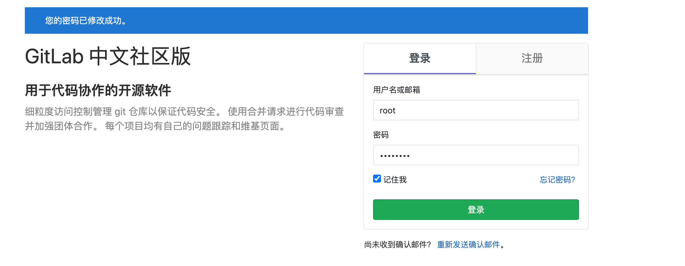

### 2.3. Creating a project

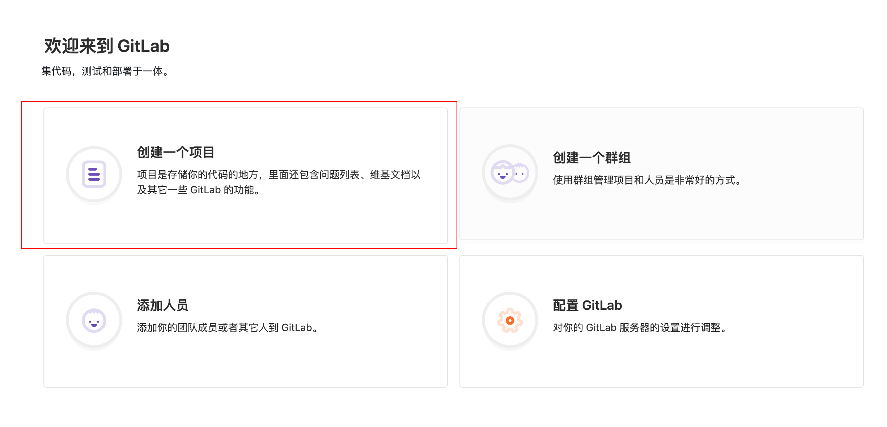

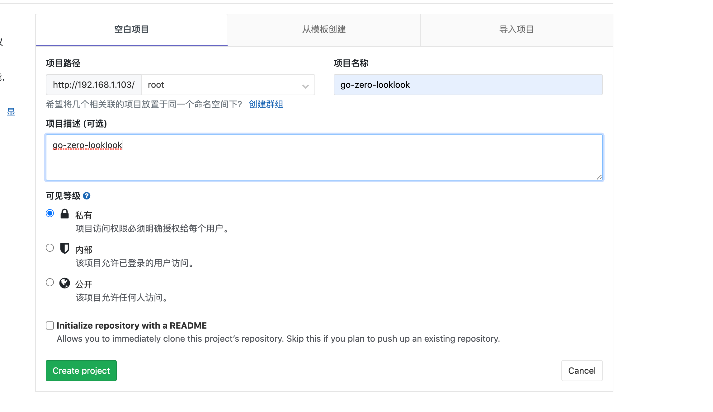

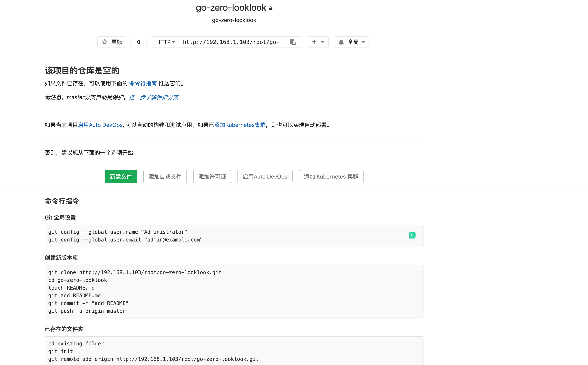

### 2.4. Configuring ssh public key

Click on the down arrow in the header position, "Settings"


Configure your own public key and click on "Add key" (the public key will not be generated by your own search, not here in detail)

### 2.5. Upload the project

Click on the project, go back to the project you just created, Will go-zero-looklook Project upload to this warehouse ssh://git@192.168.1.180:2222/root/go-zero-looklook.git To, and our gitlab build is over.

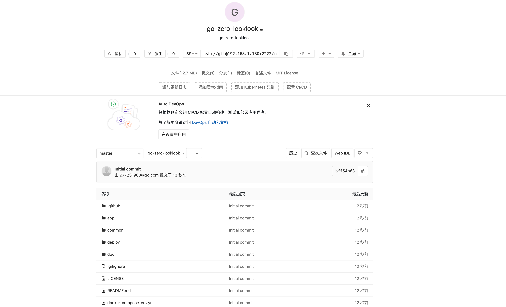

Note] This time not to do gitlab-runner demo, the follow-up if there is time to add.

## 3. harbor

### 3.1. Deploying harbor

Download harbor <https://github.com/goharbor/harbor/releases/download/v2.2.0/harbor-offline-installer-v2.2.0.tgz>, download the offline installation will be faster

Download and unzip the harbor folder

```shell
cd harbor && cp harbor.yml.tmpl harbor.yml
```

We open harbor.yml and modify it as follows

```yml
hostname: 192.168.1.180                    #Modify to local ip, can't use localhost, 127.0.0.1

http:
  port: 8077                         #Change the http port 8077

#https:                           # temporarily commented out https, we first do not pass https only copper drum http
#  port: 443
#  certificate: /your/certificate/path
#  private_key: /your/private/key/path

data_volume: /root/harbor/data   #Modify the data directory location

log:
  level: info
  local:
    rotate_count: 50
    rotate_size: 200M
    location: /root/harbor/log     #Modify the log directory location
```

Run directly "sudo . /install.sh" and wait a bit.

### 3.2. Visit harbor

Enter <http://192.168.1.180:8077> in your browser

Account: admin

Password: Harbor12345 (recorded in harbor.yml, default is Harbor12345)


Login successful


### 3.3. New private projects


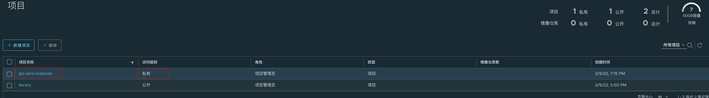

View the push command


 ```shell
 docker push 192.168.1.180:8077/go-zero-looklook/REPOSITORY[:TAG]
 ```

### 3.4. supports http

The default pull and push to the mirror repository should use https , since we do not have https here, we need to use http , so we have to execute the following on the deploy-server.com server

```shell
echo '{"insecure-registries":["192.168.1.180:8077"] }' >> /etc/docker/daemon.json
```

This is the end of our harbor build.

## 4. jenkins

### 4.1. Deploying jenkins

Create the folder

```shell
mkdir jenkins && cd jenkins
vim docker-compose.yml
```

docker-compose.yml

```yaml
version: '3'
services:
  jenkins:
    image: 'jenkins/jenkins:lts'
    container_name: jenkins
    restart: always
    environment:
      - TZ=Asia/Shanghai
    user: root
    ports:
      - '8989:8080'
      - '50000:50000'
    volumes:
      - './jenkins_home:/var/jenkins_home'
      - '/var/run/docker.sock:/var/run/docker.sock'
      - '/usr/bin/docker:/usr/bin/docker'
      - '/root/port.sh:/root/port.sh'
```

[Note] /root/port.sh reads

```sh
#!/bin/sh

case $1 in
"identity-api") echo 1001
;;
"identity-rpc") echo 1101
;;
"usercenter-api") echo 1002
;;
"usercenter-rpc") echo 1102
;;
"message-mq") echo 1207
;;
"mqueue-rpc") echo 1106
;;
"order-api") echo 1004
;;
"order-mq") echo 1204
;;
"order-rpc") echo 1104
;;
"payment-api") echo 1005
;;
"payment-rpc") echo 1105
;;
"travel-api") echo 1003
;;
"travel-rpc") echo 1103
esac
```

Exec

```shell
docker-compose up -d
```

This time is not slow, you can go for a cup of coffee again

### 4.2. Mounting tools

1) Copy goctl to the jenkins container

```shell
$ docker cp $GOPATH/bin/goctl jenkins:/usr/local/bin
$ docker exec -it jenkins /bin/sh #Enter the jenkins container
$ goctl -v   #Verify Success
goctl version 1.3.0-20220201 linux/amd64
```

2）Copy the kubectl file to the jenkins container

```shell
$ curl -LO "https://dl.k8s.io/release/$(curl -L -s https://dl.k8s.io/release/stable.txt)/bin/linux/amd64/kubectl"
$ sudo chmod a+x kubectl
$ docker cp kubectl jenkins:/usr/local/bin
$ docker exec -it jenkins /bin/sh  #Enter the jenkins container
$ kubectl version
Client Version: version.Info{Major:"1", Minor:"23", GitVersion:"v1.23.3" .....
```

Copy the k8s configuration.kube/config to the jenkins container

```shell
$ docker cp ~/.kube jenkins:/root/ #The prerequisite is the presence of the k8s config in the .kube folder in the home directory.
$ docker exec -it jenkins /bin/sh #Accessing the jenkins container
$ kubectl ge ns
default              Active   43m
kube-node-lease      Active   43m
kube-public          Active   43m
kube-system          Active   43m
local-path-storage   Active   43m
```

[Note] These 4 parts above, you can also directly hit into the mirror, I'm just demonstrating here, leave it to you to deal with.

### 4.3. visit jenkins

<http://192.168.1.180:8989>


The first time you visit the above diagram does not panic, let you wait a while, it is making preparations, when ready it will automatically jump to the login page.

The following interface appears, indicating that it is ready, because our directory is mounted out, we check the local jenkins_home/secrets/initialAdminPassword password, enter the next step can be


Select "Install recommended plug-ins"


 Then wait for the plugin to finish installing


### 4.4. Creating Users

root

root


### 4.5. Deployment completion

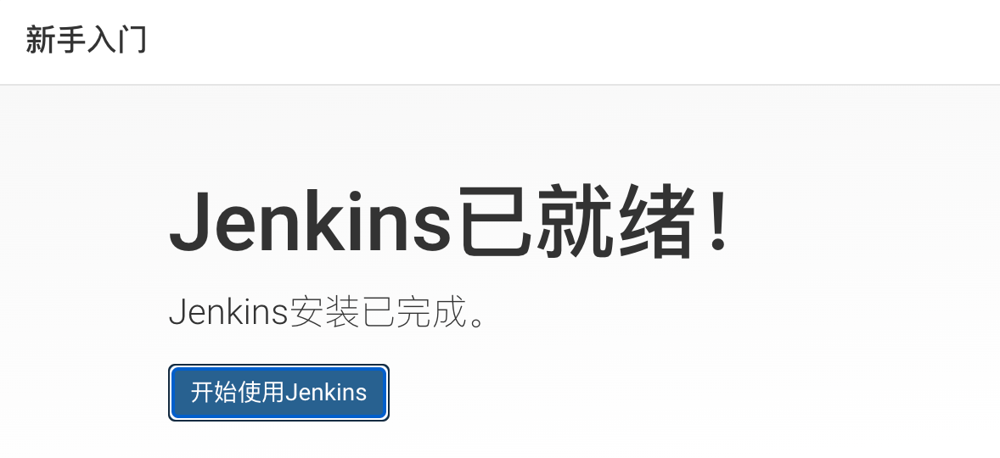

This completes the deployment of jenkins

### 4.6. Adding credentials

Click on the left menu "Manage Jenkins"

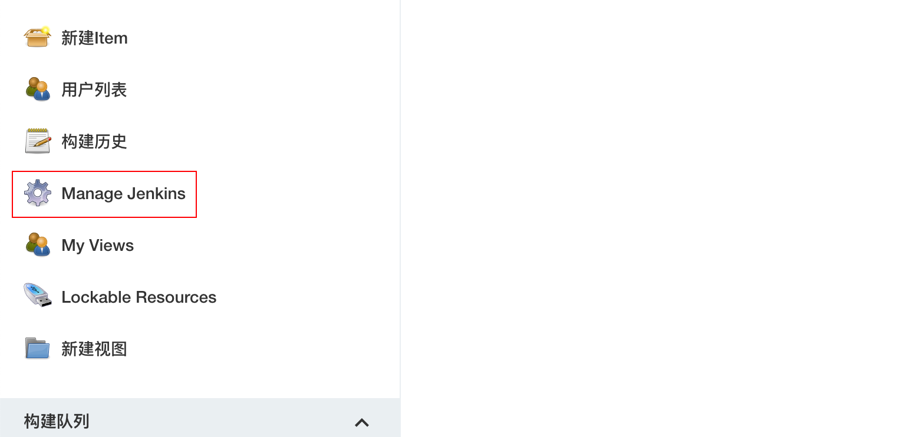

Click on "Manage Credentials"


Click on the triangle after "Global" and then on "Add Credentials"

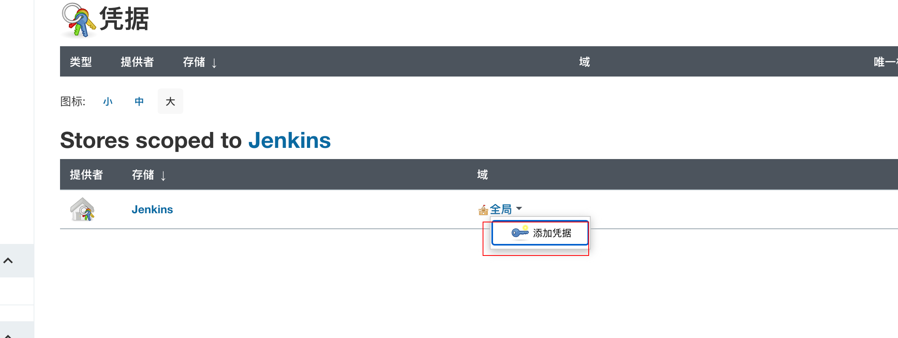

Enter the "Add credentials" page, type we choose "SSH Username with private key" to use the private key method, `Username` is a gitlab identifier, after adding Private Key` is the private key configured in gitlab (the private key corresponding to the public key we configured in gitlab before, here is our own local private key), our credentials are for jenkins to use when going to gitlab to pull code without encryption the


Just make sure.

### 4.7. Adding harbor repository configuration

Enter the home page, click the left menu `Manage Jenkins`->`Configure System`

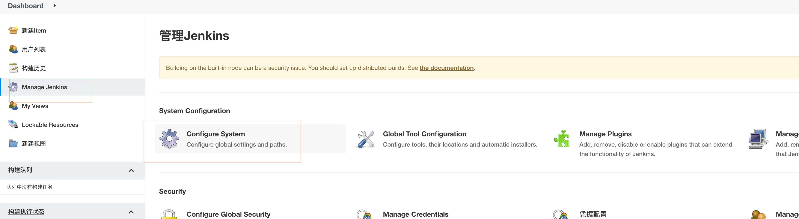

Scroll down to the `global properties` entry and add information about the docker private repository, such as `docker user name`, `docker user password`, `docker private repository address` as shown

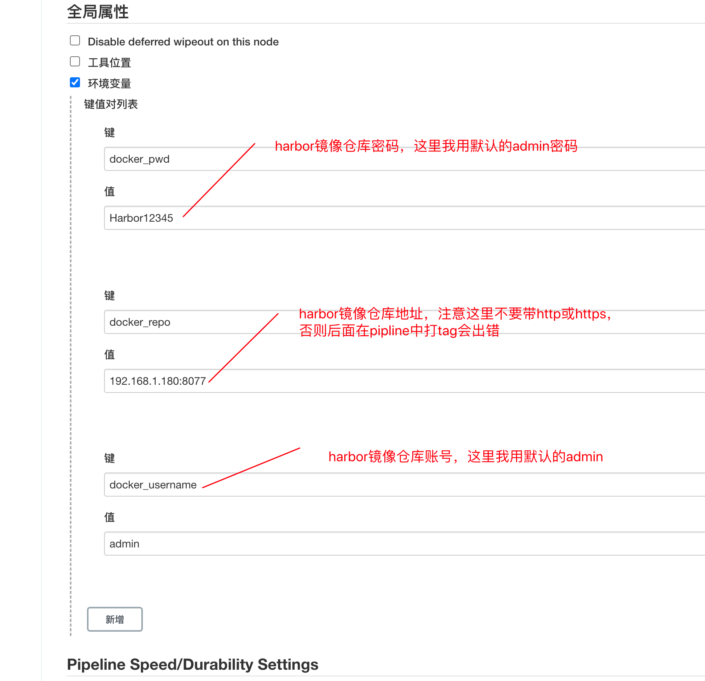

Click "Save"

### 4.8. Configuring git

Go to `Manage Jenkins`->`Global Tool Configureation`, find the Git entry, fill in the path where the git executable is located on the machine where jenkins is located, if not, you need to download the Git plugin in jenkins plugin management, if you have it, you don't need to care (as below)


Configure the Git Parameter plugin needed for pipline

Click on "System Configuration" -> "Plugin Management"


Then click on "Optional Plugins" and enter "Git Parameter" in the search, as shown below


Install it, restart it, and the jenkins build is complete.

## 5. k8s

k8s deployment here will not be introduced, their own kubeadm, rancher, kind to install it, or buy a per-volume cloud container services, in short, a k8s cluster is good.

​ 
