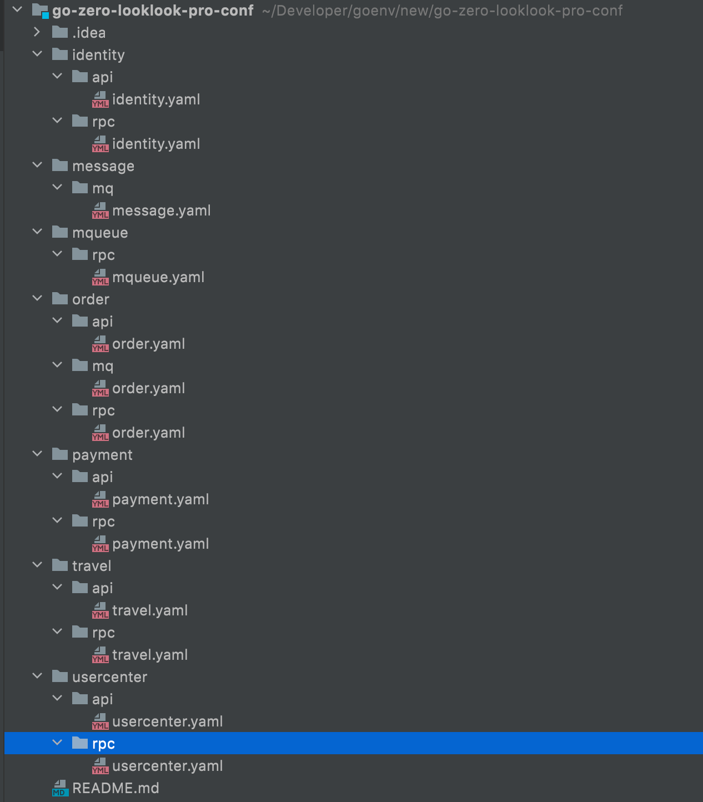
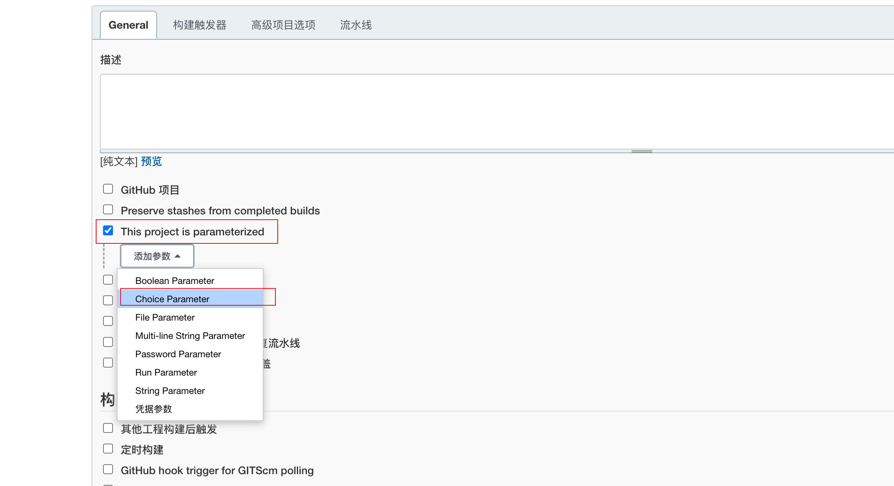
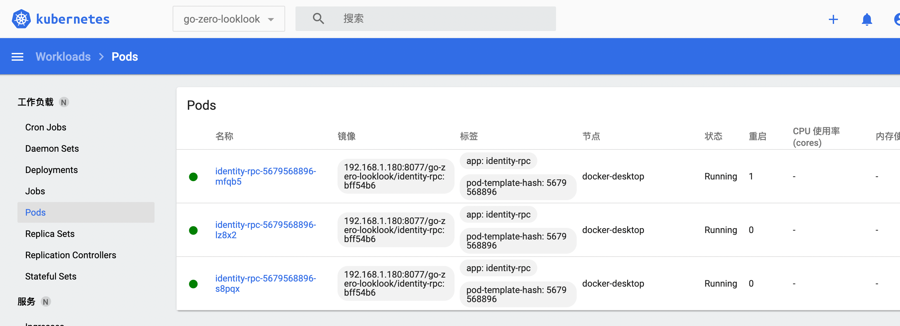

<h1>Table of Contents</h1>

- [XV. Publish services to k8s](#xv-publish-services-to-k8s)
  - [1. Overview](#1-overview)
  - [2. Deploy middleware](#2-deploy-middleware)
  - [3. Independent configuration](#3-independent-configuration)
  - [4. side write jenkins pipline](#4-side-write-jenkins-pipline)
    - [4.1 Configuration parameters](#41-configuration-parameters)
    - [4.2. Writing pipeline](#42-writing-pipeline)
  - [5. configure k8s to pull private repository images](#5-configure-k8s-to-pull-private-repository-images)
  - [6. Build](#6-build)
  - [7. Add gateway](#7-add-gateway)
  - [8. Concluding remarks](#8-concluding-remarks)

# XV. Publish services to k8s

## 1. Overview

In the last section, we have gitlab, jenkins, harbor, k8s have been built, this section we will write jenkins pipline to publish our services to k8s through jenkins complete.

## 2. Deploy middleware

Deploy mysql, redis, es, etc. outside of k8s to simulate an online standalone environment (as for online you want to deploy some middleware to k8s internal this self-processing, this time the focus is how to deploy go-zero development microservices to k8s cluster internal), here I will directly use the project under the docker-compose-env. yaml, all the dependencies of the third-party middleware environment directly installed in srv-data.com (192.168.1.181) this server, provided that this server has installed docker, docker-compose.

Login to 192.168.1.181

```shell
mkdir data && cd data && vim docker-compose.yml
docker-compose up -d
docker-compose ps #View Confirmation
```

## 3. Independent configuration

The configuration of each service are independent, unified in a git warehouse, so that only one person online warehouse permissions, if the online configuration has changed directly modify the files in this warehouse, in jenkins do cd, will first pull the code in pulling the corresponding service configuration automatically build, you can see the specific pipline later.

Q] Why not use the configuration center?

1) modify db, redis, etc. need to restart the service, but there are some configurations and do not need to restart the service, operations and maintenance have to remember, remember the mix is easier to cause online accidents

2) Convenient rollback. We send a new version to the line, and change the new version of the configuration. At this time, online user feedback problems, online need to quickly roll back, if we use the file to build into the image, directly using the k8s line of command will be able to roll back the previous version of the code and configuration directly. If you use the configuration center, roll back the code, but also the last version of the configuration to accompany the center to change back very troublesome.

Independent online repository directory structure is as follows (this structure is related to the method of writing in pipline)



Repository address: <https://github.com/Mikaelemmmm/go-zero-looklook-pro-conf> , direct download on

Note] 1, modify the configuration of the middleware, database, redis, etc. should be changed to 192.168.1.181 this machine, we take this machine as the online environment of the middleware.

2, the other is our service discovery, online we deploy in k8s, go-zero directly support k8s service discovery, so do not need etc. etc., we have to change to target, k8s configuration method when configuring zrpc client.

## 4. side write jenkins pipline

### 4.1 Configuration parameters

Visit <http://192.168.1.180:8989/> open jenkins, go to jenkins home page, click the left menu `New Item`

We first create the identity` authorization service pipeline


Then click "General", select "This project is parameterized", "Add parameter", "Choice Parameter ", as shown below



Then write the content as follows


Save directly.

### 4.2. Writing pipeline

Scroll down and find `Pipeline script`, fill in the script content

```pipline
pipeline {
  agent any
  parameters {
      gitParameter name: 'branch',
      type: 'PT_BRANCH',
      branchFilter: 'origin/(.*)',
      defaultValue: 'master',
      selectedValue: 'DEFAULT',
      sortMode: 'ASCENDING_SMART',
      description: 'Select the branch to be built'
  }

  stages {
      stage('Service Information')    {
          steps {
              sh 'echo Branches:$branch'
              sh 'echo Build Service Type:${JOB_NAME}-$type'
          }
      }


      stage('Pull code') {
          steps {
              checkout([$class: 'GitSCM',
              branches: [[name: '$branch']],
              doGenerateSubmoduleConfigurations: false,
              extensions: [],
              submoduleCfg: [],
              userRemoteConfigs: [[credentialsId: 'gitlab-cert', url: 'ssh://git@192.168.1.180:2222/root/go-zero-looklook.git']]])
          }
      }
      stage('get commit_id') {
          steps {
              echo 'get commit_id'
              git credentialsId: 'gitlab-cert', url: 'ssh://git@192.168.1.180:2222/root/go-zero-looklook.git'
              script {
                  env.commit_id = sh(returnStdout: true, script: 'git rev-parse --short HEAD').trim()
              }
          }
      }
      stage('Pull profile') {
              steps {
                  checkout([$class: 'GitSCM',
                  branches: [[name: '$branch']],
                  doGenerateSubmoduleConfigurations: false,
                  extensions: [[$class: 'RelativeTargetDirectory', relativeTargetDir: 'conf']],
                  submoduleCfg: [],
                  userRemoteConfigs: [[credentialsId: 'gitlab-cert', url: 'ssh://git@192.168.1.180:2222/root/go-zero-looklook-pro-conf.git']]])
              }
        }

      stage('goctl version') {
          steps{
              sh '/usr/local/bin/goctl -v'
          }
      }

      stage('Dockerfile Build') {
          steps{
                 sh 'yes | cp  -rf conf/${JOB_NAME}/${type}/${JOB_NAME}.yaml  app/${JOB_NAME}/cmd/${type}/etc'   //prod config
                 sh 'cd app/${JOB_NAME}/cmd/${type} && /usr/local/bin/goctl docker -go ${JOB_NAME}.go && ls -l'
                 script{
                     env.image = sh(returnStdout: true, script: 'echo ${JOB_NAME}-${type}:${commit_id}').trim()
                 }
                 sh 'echo image :${image} && cp app/${JOB_NAME}/cmd/${type}/Dockerfile ./  && ls -l && docker build  -t ${image} .'
          }
      }

      stage('Uploading to the mirror repository') {
          steps{
             //docker login Note here that the account password will be exported to the jenkins page, can be handled in a similar way through port.sh, the official website documentation has here I will not write in detail
              sh 'docker login --username=${docker_username} --password=${docker_pwd} http://${docker_repo}'
              sh 'docker tag  ${image} ${docker_repo}/go-zero-looklook/${image}'
              sh 'docker push ${docker_repo}/go-zero-looklook/${image}'
          }
      }

      stage('Deploy to k8s') {
          steps{
              script{
                  env.deployYaml = sh(returnStdout: true, script: 'echo ${JOB_NAME}-${type}-deploy.yaml').trim()
                  env.port=sh(returnStdout: true, script: '/root/port.sh ${JOB_NAME}-${type}').trim()
              }

              sh 'echo ${port}'

              sh 'rm -f ${deployYaml}'
              sh '/usr/local/bin/goctl kube deploy -secret docker-login -replicas 2 -nodePort 3${port} -requestCpu 200 -requestMem 50 -limitCpu 300 -limitMem 100 -name ${JOB_NAME}-${type} -namespace go-zero-looklook -image ${docker_repo}/${image} -o ${deployYaml} -port ${port} -serviceAccount find-endpoints '
              sh '/usr/local/bin/kubectl apply -f ${deployYaml}'
          }
      }

       stage('Clean') {
           steps{
               sh 'docker rmi -f ${image}'
               sh 'docker rmi -f ${docker_repo}/${image}'
               cleanWs notFailBuild: true
           }
       }
  }
}
```

[Note]: !!! Very important!!!

1, build optimization: pipline use "/usr/local/bin/goctl kube xxx" raw k8s yaml, we are using k8s way to deploy without etcd, but this way to deploy the generated k8s yaml need to specify the serviceAccount. The principle can be seen in this article below go -zero's k8s service discovery explanation: <https://mp.weixin.qq.com/s/-WaWJaM_ePEQOf7ExNJe7w>

I have already specified the serviceAccount: find-endpoints in the template in the kube folder under templates:

<https://github.com/Mikaelemmmm/go-zero-looklook/tree/main/deploy/goctl>

So you need to create the find-endpoints serviceAccount in your k8s and bind the appropriate permissions.

kubectl apply -f auth.yaml and that's it. auth.yaml file is as follows

````yaml
#create service-account
apiVersion: v1
kind: ServiceAccount
metadata:
  namespace: go-zero-looklook
  name: find-endpoints

---
#Create a role corresponding to the operation
apiVersion: rbac.authorization.k8s.io/v1
kind: ClusterRole
metadata:
  name: discov-endpoints
rules:
- apiGroups: [""]
  resources: ["endpoints"]
  verbs: ["get","list","watch"]

---
#Bind roles to accounts
apiVersion: rbac.authorization.k8s.io/v1
kind: ClusterRoleBinding
metadata:
  name: find-endpoints-discov-endpoints
roleRef:
  apiGroup: rbac.authorization.k8s.io
  kind: ClusterRole
  name: discov-endpoints
subjects:
- kind: ServiceAccount
  name: find-endpoints
  namespace: go-zero-looklook
````

Note】If your goctl>=1.3.3, pipline can generate k8s yaml files without using the template to support serviceAccount. You can specify serviceAccount when generating, that is, you can specify -serviceAcount directly in pipline to generate k8s yaml. Add serviceAccount : find-endpoints to the k8s yaml with the following command

```shell
/usr/local/bin/goctl kube deploy -secret docker-login -replicas 2 -nodePort 3${port} -requestCpu 200 -requestMem 50 -limitCpu 300 -limitMem 100 -name ${JOB_NAME}-${type} -namespace go-zero-looklook -image ${docker_repo}/${image} -o ${deployYaml} -port ${port} --serviceAccount find-endpoints
```

However, if your goctl <= 1.3.2, you can only manually modify the 2 templates under your template in the kube folder by adding serviceAccountName : find-endpoints to the template yourself (refer to the template link: <https://github.com/Mikaelemmmm/go>- zero-looklook/tree/v1.0.2/deploy/goctl), then use --home to specify your modified template to generate k8s yaml, the command is as follows, you should change the above command to the following command in pipline

```sh
/usr/local/bin/goctl kube deploy -secret docker-login -replicas 2 -nodePort 3${port} -requestCpu 200 -requestMem 50 -limitCpu 300 -limitMem 100 -name ${JOB_NAME}-${type} -namespace go-zero-looklook -image ${docker_repo}/${image} -o ${deployYaml} -port ${port} --home /root/template
```

Because 1.3.3 start goctl support --serviceAccount parameter, if goctl <= 1.3.2 or through the template specified in the pipline to achieve

2, ${credentialsId} to be replaced with your specific credentials value, that is, [add credentials] module in a string, we previously configured gitlab-cert so here to fill in the gitlab-cert, if you are not this own to replace, ${gitUrl} need to be replaced with the git repository address of your code, the other ${ xxx} form of variables do not need to be modified, keep the original can.

3, here and the official documentation is a little different, due to my project folder directory is different, goctl generated dockerfile file I manually do a little adjustment, in a I am not in the build time generated dockerfile, is in the creation of the project when the dockerfile together in the directory, so that when building the image does not need goctl

## 5. configure k8s to pull private repository images

By default, k8s can only pull the public image of the harbor image repository, if you pull the private repository image, it will report `ErrImagePull` and `ImagePullBackOff` errors

1, first in jenkins release machine login harbor

```shell
$ docker login 192.168.1.180:8077
$ Username: admin
$ Password:
Login Succeeded
```

2.Generate login harbor configuration file in k8s

```shell
#View the credentials generated by the previous step of logging into harbor
$ cat /root/.docker/config.json
{
 "auths": {
  "192.168.1.180:8077": {
   "auth": "YWRtaW46SGFyYm9yMTIzNDU="
  }
}
```

3.Base64 encryption of the secret key file

```shell
$ cat /root/.docker/config.json  | base64 -w 0

ewoJImF1dGhzIjogewoJCSIxOTIuMTY4LjEuMTgwOjgwNzciOiB7CgkJCSJhdXRoIjogIllXUnRhVzQ2U0dGeVltOXlNVEl6TkRVPSIKCQl9Cgl9Cn0=
```

4.Create docker-secret.yaml

```yml
apiVersion: v1
kind: Secret
metadata:
  name: docker-login
type: kubernetes.io/dockerconfigjson
data:
  .dockerconfigjson: ewoJImF1dGhzIjogewoJCSIxOTIuMTY4LjEuMTgwOjgwNzciOiB7CgkJCSJhdXRoIjogIllXUnRhVzQ2U0dGeVltOXlNVEl6TkRVPSIKCQl9Cgl9Cn0=
```

```shell
$ kubectl create -f docker-secret.yaml -n go-zero-looklook

secret "docker-login" created
```

## 6. Build

We go to the home page and click idenity to enter the details page


Then you can see the identity service we configured above, as follows, click "Build with Parameters", then select rpc, and click "Start Building"


Note] The first build will fail when pulling the code, it should initialize something, just click it again.

Deployment success




By the same token, before going to build identity-api, then go to configure the usercenter service Build usercenter-rpc, build usercenter-api, then configure the other services, build it, this time we first only build identity-api, identity-rpc, usercenter -rpc, usercenter-api to show you.

## 7. Add gateway

Because our api services published in k8s through goctl will expose the nodeport port, index we look at the nodeport port service of the service under the go-zero-looklook namespace in k8s, and then nodeport can be configured in nginx.

This time we have an independent virtual machine outside of k8s, install nginx, expose the k8s backend api service to nginx by nodeporting the port, and then nginx configure this api service in the configuration so that nginx acts as a gateway.

Remember that you must have the auth_request module, or install it yourself if you don't have it.

Configuration of nginx

```conf
server{
    listen 8081;
    access_log /var/log/nginx/looklook.com_access.log;
    error_log /var/log/nginx//looklook.com_error.log;

    location /auth {
     internal;
      proxy_set_header X-Original-URI $request_uri;
     proxy_pass_request_body off;
     proxy_set_header Content-Length "";
     proxy_pass http://192.168.1.182:31001/identity/v1/verify/token;
    }

    location ~ /usercenter/ {
       auth_request /auth;
       auth_request_set $user $upstream_http_x_user;
       proxy_set_header x-user $user;

       proxy_set_header Host $http_host;
       proxy_set_header X-Real-IP $remote_addr;
       proxy_set_header REMOTE-HOST $remote_addr;
       proxy_set_header X-Forwarded-For $proxy_add_x_forwarded_for;
       proxy_pass http://192.168.1.182:31002;
   }

   location ~ /travel/ {
       auth_request /auth;
       auth_request_set $user $upstream_http_x_user;
       proxy_set_header x-user $user;

       proxy_set_header Host $http_host;
       proxy_set_header X-Real-IP $remote_addr;
       proxy_set_header REMOTE-HOST $remote_addr;
       proxy_set_header X-Forwarded-For $proxy_add_x_forwarded_for;
       proxy_pass http://192.168.1.182:31003;
   }


    location ~ /order/ {
       auth_request /auth;
       auth_request_set $user $upstream_http_x_user;
       proxy_set_header x-user $user;

       proxy_set_header Host $http_host;
       proxy_set_header X-Real-IP $remote_addr;
       proxy_set_header REMOTE-HOST $remote_addr;
       proxy_set_header X-Forwarded-For $proxy_add_x_forwarded_for;
       proxy_pass http://192.168.1.182:31004;
   }

    location ~ /payment/ {
       auth_request /auth;
       auth_request_set $user $upstream_http_x_user;
       proxy_set_header x-user $user;

       proxy_set_header Host $http_host;
       proxy_set_header X-Real-IP $remote_addr;
       proxy_set_header REMOTE-HOST $remote_addr;
       proxy_set_header X-Forwarded-For $proxy_add_x_forwarded_for;
       proxy_pass http://192.168.1.182:31005;
   }
}
```

If it is online, you should configure multiple nginx to maintain high availability, in front of the nginx there will also be a slb, your domain name including https configuration should resolve channel slb, in front of the slb in a firewall and so on these.

## 8. Concluding remarks

At this point, the entire series is over, the overall architecture diagram should be shown in the first, this series will hopefully bring you help.
