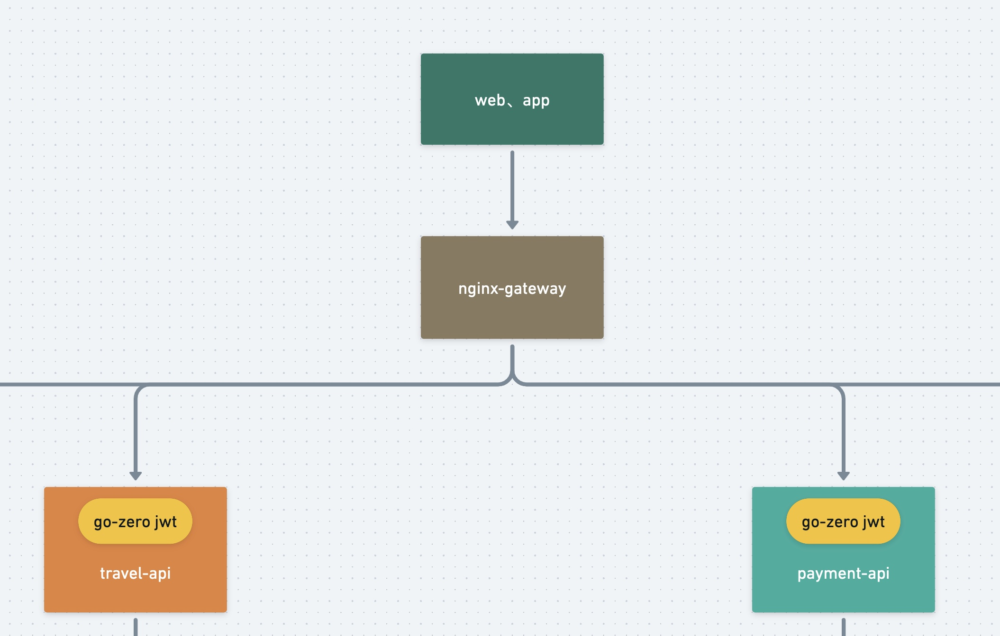

<h1>Table of Contents</h1>

- [II. Using nginx as a gateway](#ii-using-nginx-as-a-gateway)
  - [1. go-zero gateway concept](#1-go-zero-gateway-concept)
  - [2. nginx gateway](#2-nginx-gateway)
  - [3. Examples](#3-examples)
  - [4. Summary](#4-summary)

# II. Using nginx as a gateway

Address of this project :  <https://github.com/Mikaelemmmm/go-zero-looklook>

## 1. go-zero gateway concept

go-zero architecture to the big say there are mainly 2 parts, one is API, one is RPC. API is mainly http external access, RPC is mainly internal business interaction using protobuf + gRPC, when our project volume is not large, we can use API to do a monolithic project, and after the subsequent volume up, you can split to RPC to do microservices, from a single body to microservices is very easy, much like the java springboot to springcloud, very convenient.

API is understood by many students as a gateway, in a practical sense when your project is using go-zero to do microservices, you API as a gateway is not a big problem, but this leads to the problem that an API corresponds to the back of multiple RPC, API acts as a gateway, so if I update the subsequent business code, update any business to change the For example, if I just change a small and insignificant service, I have to reconstruct the whole API, which is not very reasonable and very inefficient and inconvenient. So, we just treat the API as an aggregated service, can be split into multiple API, such as user services have user services RPC and API, order services, order services RPC and API, so that when I modify the user service, I only need to update the user RPC and API, all the API is only used to aggregate the back-end RPC business. Then some students will say, I can't resolve a domain name for each service corresponding to your API, of course not, this time there should be a gateway in front of the API, this gateway is the real sense of the gateway, such as we often say nginx, kong, apisix, many microservices have built-in gateway, such as springcloud provides springcloud-gateway, go-zero does not provide, and actually do not need to write a separate gateway, the gateway on the market has been enough, go-zero official in the dawn of blackboard nginx enough to use, of course, if you are more familiar with kong, apisix can be replaced, essentially nothing different, just a unified traffic Entrance, unified authentication, etc.

## 2. nginx gateway

[Note]: When looking here, it is recommended to look at the business architecture diagram in the previous section first



The actual project also uses nginx as a gateway, using the auth_request module of nginx as a unified authentication, business internal authentication is not done (designed to the assets of the best business internal authentication, the main extra layer of security), nginx gateway configuration in the project's deploy/nginx/conf.d/looklook- gateway.conf

```conf
server{
      listen 8081;
      access_log /var/log/nginx/looklook.com_access.log;
      error_log /var/log/nginx/looklook.com_error.log;


      location ~ /order/ {
           proxy_set_header Host $http_host;
           proxy_set_header X-Real-IP $remote_addr;
           proxy_set_header REMOTE-HOST $remote_addr;
           proxy_set_header X-Forwarded-For $proxy_add_x_forwarded_for;
           proxy_pass http://looklook:1001;
      }
      location ~ /payment/ {
          proxy_set_header Host $http_host;
          proxy_set_header X-Real-IP $remote_addr;
          proxy_set_header REMOTE-HOST $remote_addr;
          proxy_set_header X-Forwarded-For $proxy_add_x_forwarded_for;
          proxy_pass http://looklook:1002;
      }
      location ~ /travel/ {
         proxy_set_header Host $http_host;
         proxy_set_header X-Real-IP $remote_addr;
         proxy_set_header REMOTE-HOST $remote_addr;
         proxy_set_header X-Forwarded-For $proxy_add_x_forwarded_for;
         proxy_pass http://looklook:1003;
      }
      location ~ /usercenter/ {
         proxy_set_header Host $http_host;
         proxy_set_header X-Real-IP $remote_addr;
         proxy_set_header REMOTE-HOST $remote_addr;
         proxy_set_header X-Forwarded-For $proxy_add_x_forwarded_for;
         proxy_pass http://looklook:1004;
      }

}

```

Container internal nginx port is 8081, use docker to expose out 8888 mapping port 8081, so that the external through 8888 to access the gateway, use location to match each service, of course, there will be people say, did not add an API service are to nginx configuration is too much trouble, you can also use confd unified configuration, self Baidu.

## 3. Examples

When we access the user service, <http://127.0.0.1:8888/usercenter/v1/user/detail> , we access the external port 8888, then map to nginx internal looklook gateway 8081, then the location matches to /usercenter/ then We have defined 2 groups of routes in the desc/API file, one group needs jwt authentication and one group does not need jwt authentication, /usercenter/v1/user/detail needs authentication so we will use go-zero's own jwt function to authentication, desc/usercenter.api file content as follows.

```doc
.........
//need login
@server(
 prefix: usercenter/v1
 group: user
 jwt: JwtAuth
)
service usercenter {

 @doc "get user info"
 @handler detail
 post /user/detail (UserInfoReq) returns (UserInfoResp)

 ......
}
```

Since the jwt token we generate in usercenter-RPC when the user registers and logs in, we are putting the userId in, so here in /usercenter/v1/user/detail, we can get the userId in ctx after the jwt authentication that comes with go-zero, with the following code.

```go
func (l *DetailLogic) Detail(req types.UserInfoReq) (*types.UserInfoResp, error) {
 userId := ctxdata.GetUidFromCtx(l.ctx)

 ......
}
```

## 4. Summary

So that we can unify the entrance, but also unified collection of logs reported, used as error analysis, or access to the user's behavior analysis. Because our daily use of nginx more, and more familiar, if you students are more familiar with kong, apisix, in understanding the above go-zero use of the concept of gateway can be directly replaced is also the same.
