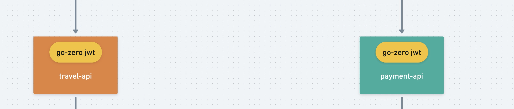

<h1>Table of Contents</h1>

- [III. Authentication Services](#iii-authentication-services)
  - [1. Forensic services](#1-forensic-services)
    - [1.1. go-zero jwt](#11-go-zero-jwt)
  - [2. install goctl . protoc.protoc-gen-go](#2-install-goctl--protocprotoc-gen-go)
  - [3. Summary](#3-summary)

# III. Authentication Services

Address of this project :  <https://github.com/Mikaelemmmm/go-zero-looklook>

## 1. Forensic services



### 1.1. go-zero jwt

As we mentioned in the previous section, in the desc/api file we defined the jwt middleware that comes with go-zero, after generating the code we can see the routing of the api service that defines jwt, here we take the usercenter service as an example, we can look at the go-zero-looklook/app/usercenter/ cmd/api/internal/handler/routes.go The code is as follows

```go
// Code generated by goctl. DO NOT EDIT.
package handler

 ........

 server.AddRoutes(
  []rest.Route{
   {
    Method:  http.MethodPost,
    Path:    "/user/detail",
    Handler: user.DetailHandler(serverCtx),
   },
   {
    Method:  http.MethodPost,
    Path:    "/user/wxMiniAuth",
    Handler: user.WxMiniAuthHandler(serverCtx),
   },
  },
  rest.WithJwt(serverCtx.Config.JwtAuth.AccessSecret),
  rest.WithPrefix("/usercenter/v1"),
 )
}


```

WithJwt , is for a set of routes using jwt forensics, the specific implementation can go look at the rest.WithJwt source code, go-zero jwt also implements the automatic refresh token function, this is left to you to check the source code to find out.

## 2. install goctl . protoc.protoc-gen-go

Note] This has nothing to do with forensics, just write the code to be used later, here it is best to install the

1.install goctl

```shell
 for Go 1.15 and earlier
GO111MODULE=on go get -u github.com/zeromicro/go-zero/tools/goctl@latest

 for Go 1.16 and later
go install github.com/zeromicro/go-zero/tools/goctl@latest
```

Verify successful installation

```shell
goctl --version
```

Goctl custom template template: copy the contents of the data/goctl folder in the project directory to the .goctl in the home directory, goctl will give priority to the contents of this template when generating code

```shell
cp -r data/goctl ~/.goctl
```

2.Install protoc

Link: <https://github.com/protocolbuffers/protobuf/releases>

Directly find the corresponding platform protoc, I am mac intel chip, so directly find the protoc-3.19.3-osx-x86_64.zip, extract it and go to the bin directory under that directory, copy the protoc directly to your gopath/bin directory.

Verify that the installation is successful

```shell
protoc --version
```

3.install protoc-gen-go

```shell
go install google.golang.org/protobuf/cmd/protoc-gen-go@latest 
```

Just check if there is protoc-gen-go under $GOPATH/bin

Note】:If you encounter the following problems when using goctl to generate code

```shell
protoc  --proto_path=/Users/seven/Developer/goenv/go-zero-looklook/app/usercenter/cmd/rpc/pb usercenter.proto --go_out=plugins=grpc:/Users/seven/Developer/goenv/go-zero-looklook/app/usercenter/cmd/rpc --go_opt=Musercenter.proto=././pb
goctl: generation error: unsupported plugin protoc-gen-go which installed from the following source:
google.golang.org/protobuf/cmd/protoc-gen-go, 
github.com/protocolbuffers/protobuf-go/cmd/protoc-gen-go;

Please replace it by the following command, we recommend to use version before v1.3.5:
go get -u github.com/golang/protobuf/protoc-gen-go
goctl version: 1.3.0 darwin/amd64
```

Direct execution

```shell
go get -u github.com/golang/protobuf/protoc-gen-go
```

4.install protoc-gen-go-grpc

```shell
go install google.golang.org/grpc/cmd/protoc-gen-go-grpc@latest
```

## 3. Summary

In general, identity is quite simple. The whole process is as follows.

user initiates a request for resources -> nginx gateway -> match to the corresponding service module -> auth module -> identity-api -> identity-rpc -> user requested resources
