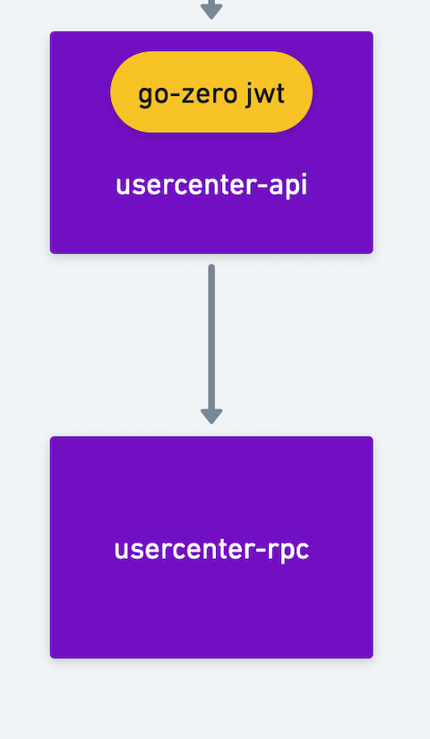
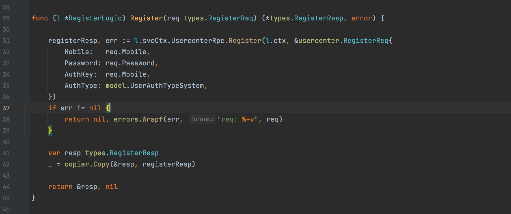
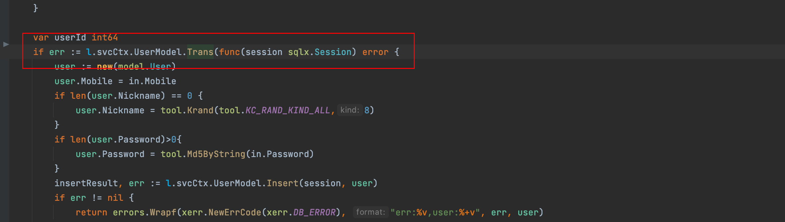

<h1>Table of Contents</h1>

- [IV. User Service](#iv-user-service)
  - [1. User Business Architecture Diagram](#1-user-business-architecture-diagram)
  - [2. Dependencies](#2-dependencies)
  - [3. Registration to give an example](#3-registration-to-give-an-example)
    - [3.1. Register api service](#31-register-api-service)
    - [3.2. Register for rpc services](#32-register-for-rpc-services)
  - [4. Business to get the login user id](#4-business-to-get-the-login-user-id)

# IV. User Service

Address of this project :  <https://github.com/Mikaelemmmm/go-zero-looklook>

## 1. User Business Architecture Diagram



## 2. Dependencies

 usercenter-api (user-center api) relies on usercenter-rpc (user-center rpc)

We look at the project usercenter/cmd/api/desc/usercenter.api , all the user api external http methods are in here

There are 4 business registration, login, get user information, WeChat applet authorization

## 3. Registration to give an example

### 3.1. Register api service

When we write api service code is to first define the methods in service in usercenter.api, and then write request, response in desc/user, the advantage of this split is not so bloated

1. Define the registration method in usercenter.api as follows

```go
// Interface for user module v1 version
@server(
 prefix: usercenter/v1
 group: user
)
service usercenter {
  @doc "register"
 @handler register
 post /user/register (RegisterReq) returns (RegisterResp)

  .....
}
```

2. Exists in app/usercenter/cmd/api/desc/user/user.api - Defined in RegisterReq\RegisterResp

```go
type (
 RegisterReq {
  Mobile   string `json:"mobile"`
  Password string `json:"password"`
 }
 RegisterResp {
  AccessToken  string `json:"accessToken"`
  AccessExpire int64  `json:"accessExpire"`
  RefreshAfter int64  `json:"refreshAfter"`
 }
)
```

3.goctl generate api code

1）Go to the app/usercenter/cmd/api/desc directory on the command line.

2) Go to deploy/script/gencode/gen.sh in the project directory, copy the following command and execute it in the command line (the command line should switch to the app/usercenter/cmd/api/desc directory)

```shell
goctl api go -api *.api -dir ../  -style=goZero
```

4. Open the app/usercenter/cmd/api/internal/logic/user/register.go file



Here it is very easy, directly call the user's rpc service can be

Here is a tip, many students feel that the fields returned by the rpc service and api definition is similar, each time you have to manually copy the trouble, so go there is no java like BeanCopyUtils.copy such a tool? Copy , this library is another new work of gorm authors , is not very excited . Then we continue to see what it looks like to call the back-end rpc.

### 3.2. Register for rpc services

- Define the protobuf file

  We create a new usercenter.proto in app/usercenter/cmd/rpc/pb and write the registration method

  ```protobuf
  //req .resp
  message RegisterReq {
    string mobile = 1;
    string nickname = 2;
    string password = 3;
    string authKey = 4;
    string authType = 5;
  }
  message RegisterResp {
    string accessToken = 1;
    int64  accessExpire = 2;
    int64  refreshAfter = 3;
  }

  //service
  service usercenter {
    rpc register(RegisterReq) returns(RegisterResp);
    ......
  }
  ```

- Use goctl to generate the code, here you do not need to manually knock

  1) Go to the app/usercenter/cmd/rpc/pb directory on the command line.

  2) Go to deploy/script/gencode/gen.sh in the project directory, copy the following two commands and execute them on the command line (the command line should switch to the app/usercenter/cmd/rpc/pb directory)

  ```shell
  goctl rpc protoc *.proto --go_out=../ --go-grpc_out=../  --zrpc_out=../
  sed -i "" 's/,omitempty//g' *.pb.go
  ```

- Open app/usercenter/cmd/rpc/internal/logic/registerLogic.go to write the logic code

  ```go

  func (l *RegisterLogic) Register(in *usercenter.RegisterReq) (*usercenter.RegisterResp, error) {

   user, err := l.svcCtx.UserModel.FindOneByMobile(l.ctx,in.Mobile)
   if err != nil && err != model.ErrNotFound {
    return nil, errors.Wrapf(xerr.NewErrCode(xerr.DB_ERROR), "mobile:%s,err:%v", in.Mobile, err)
   }
   if user != nil {
    return nil, errors.Wrapf(ErrUserAlreadyRegisterError, "Register user exists mobile:%s,err:%v", in.Mobile, err)
   }

   var userId int64
   if err := l.svcCtx.UserModel.Trans(l.ctx,func(ctx context.Context,session sqlx.Session) error {
    user := new(model.User)
    user.Mobile = in.Mobile
    if len(user.Nickname) == 0 {
     user.Nickname = tool.Krand( 8, tool.KC_RAND_KIND_ALL)
    }
    if len(in.Password) > 0 {
     user.Password = tool.Md5ByString(in.Password)
    }
    insertResult, err := l.svcCtx.UserModel.Insert(ctx,session, user)
    if err != nil {
     return errors.Wrapf(xerr.NewErrCode(xerr.DB_ERROR), "Register db user Insert err:%v,user:%+v", err, user)
    }
    lastId, err := insertResult.LastInsertId()
    if err != nil {
     return errors.Wrapf(xerr.NewErrCode(xerr.DB_ERROR), "Register db user insertResult.LastInsertId err:%v,user:%+v", err, user)
    }
    userId = lastId

    userAuth := new(model.UserAuth)
    userAuth.UserId = lastId
    userAuth.AuthKey = in.AuthKey
    userAuth.AuthType = in.AuthType
    if _, err := l.svcCtx.UserAuthModel.Insert(ctx,session, userAuth); err != nil {
     return errors.Wrapf(xerr.NewErrCode(xerr.DB_ERROR), "Register db user_auth Insert err:%v,userAuth:%v", err, userAuth)
    }
    return nil
   }); err != nil {
    return nil, err
   }

   //2.Generate the token, so that the service doesn't call rpc internally
   generateTokenLogic :=NewGenerateTokenLogic(l.ctx,l.svcCtx)
   tokenResp,err:=generateTokenLogic.GenerateToken(&usercenter.GenerateTokenReq{
    UserId: userId,
   })
   if err != nil {
    return nil, errors.Wrapf(ErrGenerateTokenError, "GenerateToken userId : %d", userId)
   }

   return &usercenter.RegisterResp{
    AccessToken:  tokenResp.AccessToken,
    AccessExpire: tokenResp.AccessExpire,
    RefreshAfter: tokenResp.RefreshAfter,
   }, nil
  }
  ```

  The registration is designed to 2 tables, a user table, a user_auth table, user is to store the basic information of the user, user_auth is to authorize the login information according to different platforms, so here designed to local transactions, as go-zero transactions to be used in the model, but I did a processing in the model, put it in the model, so that it can be used in the logic

  The Trans method is defined in the model to expose the transaction to the logic

  

  Use directly in logic

  

  As the project supports small programs, cell phone number, small program registration does not require a password, so in the processing of the password to do a processing, cell phone number registration to pass the password, small program registration does not need to pass the password, as for the cell phone number registration password can not be empty to the api service when the cell phone number registration to determine their own

  

  ​

  After the successful registration of usercenter-rpc, you need to request a token for the front-end login

  ```go
   //2.Generate the token, so that the service doesn't call rpc internally
   generateTokenLogic :=NewGenerateTokenLogic(l.ctx,l.svcCtx)
   tokenResp,err:=generateTokenLogic.GenerateToken(&usercenter.GenerateTokenReq{
    UserId: userId,
   })
   if err != nil {
    return nil, errors.Wrapf(ErrGenerateTokenError, "GenerateToken userId : %d", userId)
   }
  ```

  in GenerateToken as follows

  ```protobuf
  func (l *GenerateTokenLogic) GenerateToken(in *pb.GenerateTokenReq) (*pb.GenerateTokenResp, error) {
   now := time.Now().Unix()
   accessExpire := l.svcCtx.Config.JwtAuth.AccessExpire
   accessToken, err := l.getJwtToken(l.svcCtx.Config.JwtAuth.AccessSecret, now, accessExpire, in.UserId)
   if err != nil {
    return nil, errors.Wrapf(ErrGenerateTokenError, "getJwtToken err userId:%d , err:%v", in.UserId, err)
   }

   return &pb.GenerateTokenResp{
    AccessToken:  accessToken,
    AccessExpire: now + accessExpire,
    RefreshAfter: now + accessExpire/2,
   }, nil
  }

  func (l *GenerateTokenLogic) getJwtToken(secretKey string, iat, seconds, userId int64) (string, error) {

   claims := make(jwt.MapClaims)
   claims["exp"] = iat + seconds
   claims["iat"] = iat
   claims[ctxdata.CtxKeyJwtUserId] = userId
   token := jwt.New(jwt.SigningMethodHS256)
   token.Claims = claims
   return token.SignedString([]byte(secretKey))
  }
  ```

  Register successfully and get token, token expiration time, replacement token time to api service

## 4. Business to get the login user id

In the file go-zero-looklook/common/ctxdata/ctxData.go

```go
func GetUidFromCtx(ctx context.Context) int64 {
 var uid int64
 if jsonUid, ok := ctx.Value(CtxKeyJwtUserId).(json.Number); ok {
  if int64Uid, err := jsonUid.Int64(); err == nil {
   uid = int64Uid
  } else {
   logx.WithContext(ctx).Errorf("GetUidFromCtx err : %+v", err)
  }
 }
 return uid
}


```

GetUidFromCtx(l.ctx), we can see that we can get the
