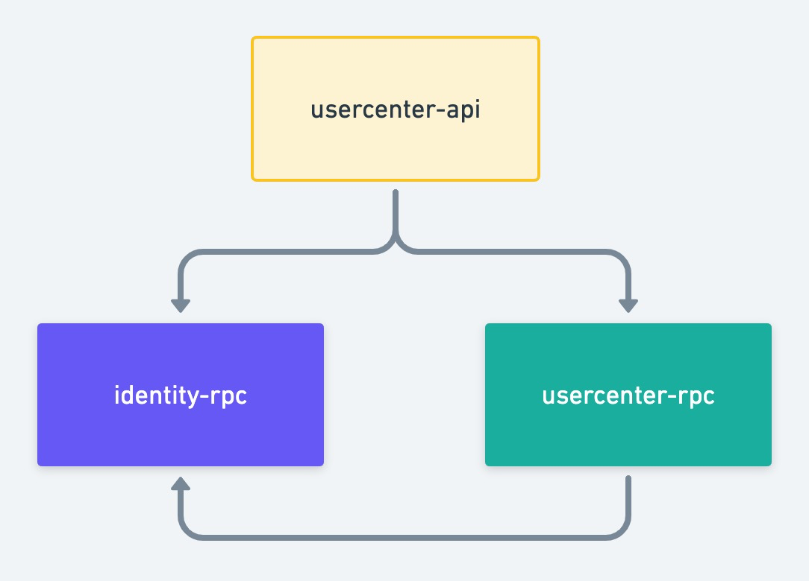
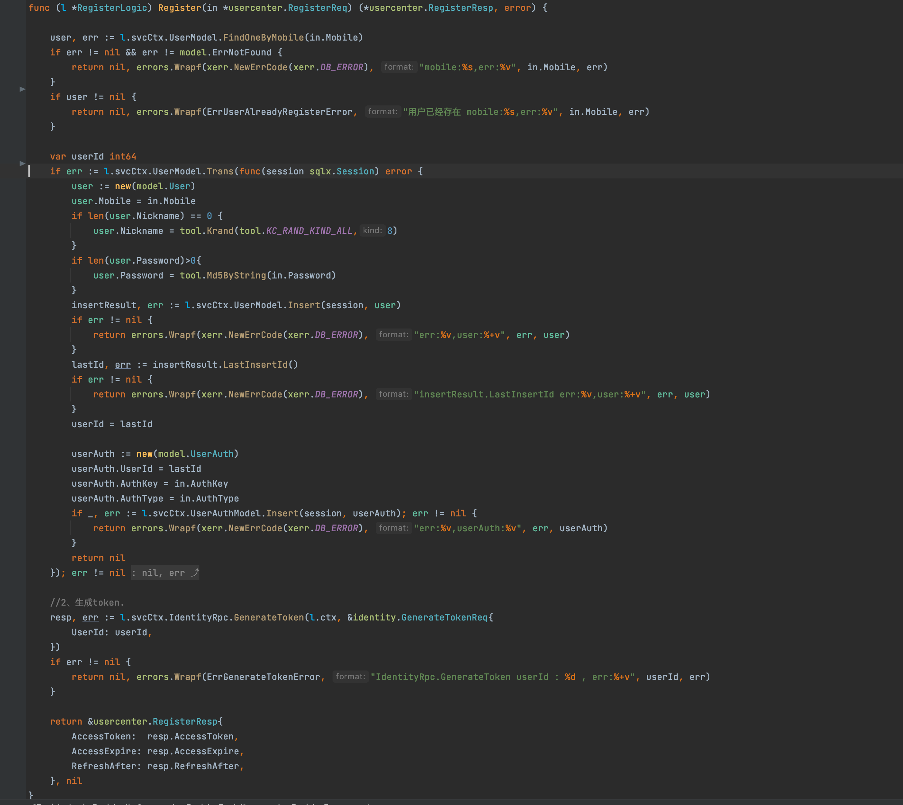
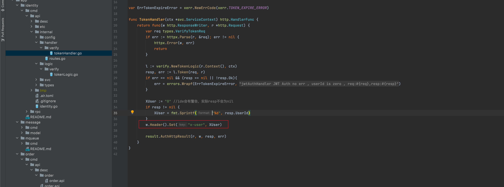
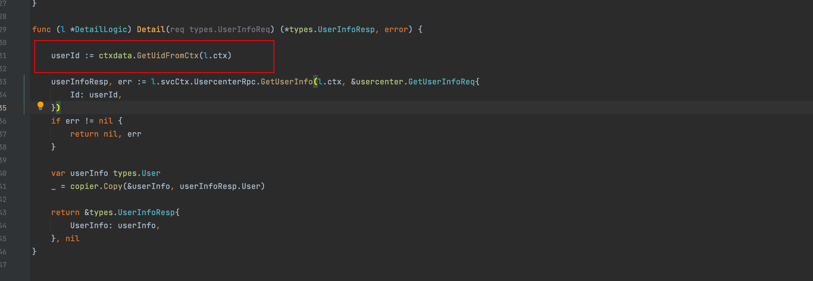
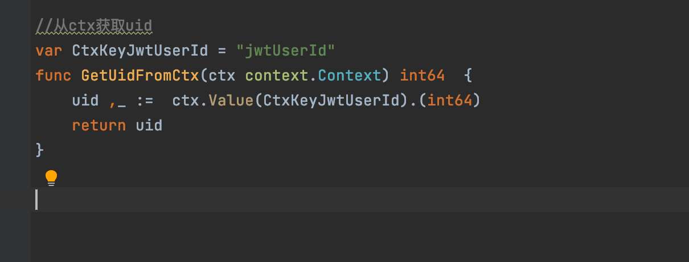

### 四、User Service

Address of this project :  https://github.com/Mikaelemmmm/go-zero-looklook


#### 1、User Business Architecture Diagram




#### 2、Dependencies

 usercenter-api (user-center api) relies on identity-rpc (authorization authentication rpc), usercenter-rpc (user-center rpc)

 usercenter-rpc (user-center rpc) depends on identity-rpc (authorization-center rpc)


We look at the project usercenter/cmd/api/desc/usercenter.api , all the user api external http methods are in here

There are 4 business registration, login, get user information, WeChat applet authorization


#### 3、Registration to give an example


##### 1、Register api service

When we write api service code is to first define the methods in service in usercenter.api, and then write request, response in desc/user, the advantage of this split is not so bloated

1. Define the registration method in usercenter.api as follows

```go
//用户模块v1版本的接口
@server(
	prefix: usercenter/v1
	group: user
)
service usercenter {
  @doc "注册"
	@handler register
	post /user/register (RegisterReq) returns (RegisterResp)
  
  .....
}
```

2、在app/usercenter/cmd/api/desc/user/user.api中定义RegisterReq\RegisterResp

```go
type (
	RegisterReq {
		Mobile   string `json:"mobile"`
		Password string `json:"password"`
	}
	RegisterResp {
		AccessToken  string `json:"accessToken"`
		AccessExpire int64  `json:"accessExpire"`
		RefreshAfter int64  `json:"refreshAfter"`
	}
)
```

3、goctl generate api code

1）Go to the app/usercenter/cmd/api/desc directory on the command line.

2) Go to deploy/script/gencode/gen.sh in the project directory, copy the following command and execute it in the command line (the command line should switch to the app/usercenter/cmd/api/desc directory)

```shell
$ goctl api go -api *.api -dir ../  -style=goZero
```

4. Open the app/usercenter/cmd/api/internal/logic/user/register.go file


Here it is very easy, directly call the user's rpc service can be

Here is a tip, many students feel that the fields returned by the rpc service and api definition is similar, each time you have to manually copy the trouble, so go there is no java like BeanCopyUtils.copy such a tool? Copy , this library is another new work of gorm authors , is not very excited . Then we continue to see what it looks like to call the back-end rpc.


##### 2、Register for rpc services

- Define the protobuf file

  We create a new usercenter.proto in app/usercenter/cmd/rpc/pb and write the registration method

  ```protobuf
  //req 、resp
  message RegisterReq {
    string mobile = 1;
    string nickname = 2;
    string password = 3;
    string authKey = 4;
    string authType = 5;
  }
  message RegisterResp {
    string accessToken = 1;
    int64  accessExpire = 2;
    int64  refreshAfter = 3;
  }
  
  //service
  service usercenter {
    rpc register(RegisterReq) returns(RegisterResp);
    ......
  }
  ```

  

- Use goctl to generate the code, here you do not need to manually knock

  1) Go to the app/usercenter/cmd/rpc/pb directory on the command line.

  2) Go to deploy/script/gencode/gen.sh in the project directory, copy the following two commands and execute them on the command line (the command line should switch to the app/usercenter/cmd/rpc/pb directory)

  ```shell
  $  goctl rpc protoc *.proto --go_out=../ --go-grpc_out=../  --zrpc_out=../
  $  sed -i "" 's/,omitempty//g' *.pb.go
  ```

- Open app/usercenter/cmd/rpc/internal/logic/registerLogic.go to write the logic code

  

  

  The registration is designed to 2 tables, a user table, a user_auth table, user is to store the basic information of the user, user_auth is to authorize the login information according to different platforms, so here designed to local transactions, as go-zero transactions to be used in the model, but I did a processing in the model, put it in the model, so that it can be used in the logic

  The Trans method is defined in the model to expose the transaction to the logic

  

  Use directly in logic

  

  As the project supports small programs, cell phone number, small program registration does not require a password, so in the processing of the password to do a processing, cell phone number registration to pass the password, small program registration does not need to pass the password, as for the cell phone number registration password can not be empty to the api service when the cell phone number registration to determine their own

  

  ​	
  
  After the successful registration of usercenter-rpc, you need to request a token for the front-end login, and directly request identity-rpc to issue the token of the user
  
  
  
  
  
  in identity-rpc as follows
  
  ```protobuf
  message GenerateTokenReq {
    int64 userId = 1;
  }
  message GenerateTokenResp {
    string accessToken = 1;
    int64  accessExpire = 2;
    int64  refreshAfter = 3;
  }
  
  
  service identity{
     // Generate token, open access only for user services
    rpc generateToken(GenerateTokenReq) returns(GenerateTokenResp);
    .....
  }
  ```
  
  generatetokenlogic.go
  
  ```go
  // GenerateToken Generate a token and open access to the user service only.
  func (l *GenerateTokenLogic) GenerateToken(in *pb.GenerateTokenReq) (*pb.GenerateTokenResp, error) {
  
  	now := time.Now().Unix()
  	accessExpire := l.svcCtx.Config.JwtAuth.AccessExpire
  	accessToken, err := l.getJwtToken(l.svcCtx.Config.JwtAuth.AccessSecret, now, accessExpire, in.UserId)
  	if err != nil {
  		return nil, errors.Wrapf(ErrGenerateTokenError, "getJwtToken err userId:%d , err:%v", in.UserId, err)
  	}
  
  	//store redis
  	userTokenKey := fmt.Sprintf(globalkey.CacheUserTokenKey, in.UserId)
  	err = l.svcCtx.RedisClient.Setex(userTokenKey, accessToken, int(accessExpire))
  	if err != nil {
  		return nil, errors.Wrapf(ErrGenerateTokenError, "SetnxEx err userId:%d, err:%v", in.UserId, err)
  	}
  
  	return &pb.GenerateTokenResp{
  		AccessToken:  accessToken,
  		AccessExpire: now + accessExpire,
  		RefreshAfter: now + accessExpire/2,
  	}, nil
  }
  ```
  
  Register successfully and go to identity-rpc to get token, token expiration time, replacement token time to api service


#### 4、Business to get the login user id

When we get user information, or order and other scenarios always need to get the login user id, the previous article we talked about, we in the authorization identity service after verification token, parsed out userId will be put into the header returned to the authReuest nginx

In the file app/identity/cmd/api/internal/handler/verify/tokenHandler.go



When nginx passes authRequest and then accesses the back-end service, it will pass the header content to the back-end service, because we have configured the following in nginx


In that case, we can get the userId in the backend service, for example, we now visit usercenter/v1/user/detail to get the current login user information



GetUidFromCtx(l.ctx), why is it so amazing? Let's click on this method



In fact, it is the userId from the ctx, is not very strange, we clearly in the nignx on the header, you in the go business code why can get through the ctx?

##### 1、【Tips】middleware

When nginx carries the x-user is userId in the header to access the backend service, the main function of our backend service will load a global middleware when it starts, such as the main in usercenter-api

app/usercenter/cmd/api/usercenter.go


The global middleware is defined here, so whenever a request comes to usercenter-ap before a certain method, it will go to the global middleware first, and the middleware details are as follows


So is it clear at once, when requesting our usercenter/v1/user/detail, will first enter this middleware, in this middleware, we through the nginx header in the X-User to get the parsed userId into the ctx, that continue to enter the usercenter/v1/user/detail, we can not be directly removed through the ctx to use in the business la, all the truth is clear.


The same other user center service login, get login user information, small program authorization login are a reason, here will not be verbose, see the code on their own can

Note] small program authorized login, remember to modify the configuration file, here the configuration file is false, change to their own


