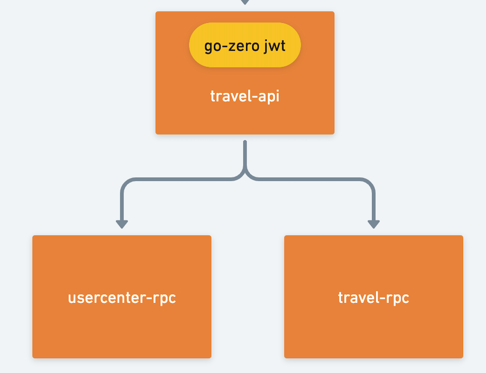
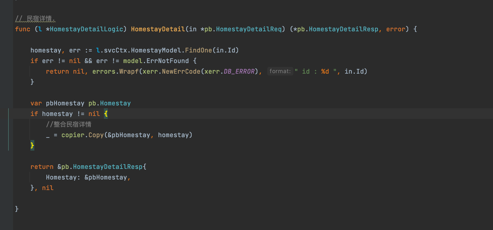

<h1>Table of Contents</h1>

- [V. Travel Service](#v-travel-service)
  - [1. business structure diagram](#1-business-structure-diagram)
  - [2. Dependencies](#2-dependencies)
  - [3. Example: Room list (for your preference)](#3-example-room-list-for-your-preference)
    - [3.1. api](#31-api)
    - [3.2【Tips】 mapreduce](#32tips-mapreduce)
    - [3.3. rpc service](#33-rpc-service)
      - [3.4 【Tips】 model cache, singleflight](#34-tips-model-cache-singleflight)
    - [4. the end](#4-the-end)

# V. Travel Service

Address of this project :  <https://github.com/Mikaelemmmm/go-zero-looklook>

## 1. business structure diagram



## 2. Dependencies

 travel-api (B&B api) depends on travel-rpc (B&B rpc), usercenter-rpc (user-center rpc)

travel is divided into several businesses

- homestay :room listings

```protobuf

@server(
 prefix: travel/v1
 group: homestay
)
service travel {

 @doc "room-list（for your preference）"
 @handler homestayList
 post /homestay/homestayList (HomestayListReq) returns (HomestayListResp)

 @doc "Landlord's list of all rooms"
 @handler businessList
 post /homestay/businessList (BusinessListReq) returns (BusinessListResp)

 @doc "Guess your favorite room list"
 @handler guessList
 post /homestay/guessList (GuessListReq) returns (GuessListResp)

 @doc "Room Details"
 @handler homestayDetail
 post /homestay/homestayDetail (HomestayDetailReq) returns (HomestayDetailResp)

}
```

- homestayBusiness : travel bisuness

```protobuf

@server(
 prefix: travel/v1
 group: homestayBussiness
)
service travel {
 @doc "Best Landlord"
 @handler goodBoss
 post /homestayBussiness/goodBoss (GoodBossReq) returns (GoodBossResp)

 @doc "Store List"
 @handler homestayBussinessList
 post /homestayBussiness/homestayBussinessList (HomestayBussinessListReq) returns (HomestayBussinessListResp)

 @doc "Landlord Information"
 @handler homestayBussinessDetail
 post /homestayBussiness/homestayBussinessDetail (HomestayBussinessDetailReq) returns (HomestayBussinessDetailResp)
}
```

- homestayComment : travel-comment

```protobuf

@server(
 prefix: travel/v1
 group: homestayComment
)
service travel {
 @doc "travel comment list"
 @handler commentList
 post /homestayComment/commentList (CommentListReq) returns (CommentListResp)
}
```

## 3. Example: Room list (for your preference)

### 3.1. api

1.Writing api interface files

app/travel/cmd/api/desc/homestay/homestay.api

```protobuf
type (
 HomestayListReq {
  LastId   int64  `json:"lastId"`
  PageSize int64  `json:"pageSize"`
  RowType  string `json:"rowType"` //preferredHomestay:Preferred
 }
 HomestayListResp {
  List []Homestay `json:"list"`
 }
)


```

app/travel/cmd/api/desc/travel.api

```protobuf
import (
 "homestay/homestay.api"
 ....
)


@server(
 prefix: travel/v1
 group: homestay
)
service travel {

 @doc "room list（Preferred）"
 @handler homestayList
 post /homestay/homestayList (HomestayListReq) returns (HomestayListResp)

 ......
}
```

2.goctl generate api code

1）Go to app/travel/cmd/api/desc directory in the command line.

2) Go to deploy/script/gencode/gen.sh in the project directory, copy the following command and execute it in the command line (the command line should switch to app/travel/cmd directory)

```shell
goctl api go -api *.api -dir ../  -style=goZero
```

3.Open app/travel/cmd/api/internal/logic/homestay/homestayListLogic.go


Because our recommendations are configured in the background, we created an activity table (here you can also choose to configure to redis), in short, we just get the configured recommended bed and breakfast id from the activity table first, and then go through the id to get the corresponding bed and breakfast information list.

### 3.2【Tips】 mapreduce

Here you can see, I got the id collection, not the ordinary foreach one by one to get, but the use of go-zero for us to encapsulate a good mapreduce to get the data, so you can concurrently go to get the data, rather than to go to get a finish in the next one, the time greatly shortened, here just want to build to show such a function, some students have to be serious, you can pass an id slice or id arr to the rpc, and then in the rpc to concurrently get each, so there is nothing wrong, I just show you this function

### 3.3. rpc service

Define the protobuf file

app/travel/cmd/rpc/pb/travel.proto

```protobuf
//model
message Homestay {
    int64   id = 1;
    string  title = 2;
    string  subTitle = 3;
    string  banner = 4;
    string  info = 5;
    int64   peopleNum = 6;
    int64   homestayBusinessId = 7;   //business id
    int64   userId = 8;               //Landlord id
    int64   rowState = 9;             //0:down 1:up
    int64   rowType = 10;             //Selling type 0: Sold by room 1: Sold by person
    string  foodInfo = 11;            //Meal standard
    int64   foodPrice = 12;           //Meal price (cents)
    int64   homestayPrice = 13;       //room prices (cents)
    int64   marketHomestayPrice = 14; //market room price (cent)
}

//req .resp
message HomestayDetailReq {
  int64   id = 1;
}
message HomestayDetailResp {
  Homestay homestay = 1;
}

//service
service travel {
    //info
    rpc homestayDetail(HomestayDetailReq) returns(HomestayDetailResp);
}
```

- Use goctl to generate the code, here you do not need to manually knock

  1) Command line into the app/travel/cmd/rpc/pb directory.

  2) Go to deploy/script/gencode/gen.sh in the project directory, copy the following two commands and execute them on the command line (the command line should switch to the app/travel/cmd directory)

  ```shell
  goctl rpc protoc *.proto --go_out=../ --go-grpc_out=../  --zrpc_out=../
  sed -i "" 's/,omitempty//g' *.pb.go
  ```

- Open app/travel/cmd/rpc/internal/logic/homestayDetailLogic.go to write the logic code

  

  There is little logic here, query Findone, and then return to the api, because the api side is passed through the id, and then you can see that our side once again used the previous sheet mentioned the gorm authors provide another magic tool copier, the last section is used in the api, the rpc proto file data copy to the api file , here you can see that we copy the data returned by the model to the proto data can also be used, how is it very convenient.

#### 3.4 【Tips】 model cache, singleflight

  Here why we do not go to findlist, because we have a cache in the findone method, we query data one by one according to the id, only the first time will hit the db, the other time is basically hit the redis cache, so not only fast, even when the traffic surge, will not all hit the db, but all in the redis, so will greatly improve the speed of our system access and db support capabilities.

  Generally we maintain our own db cache will be written piecemeal, but go-zero uses the built-in tool goctl generated mod, comes with sqlc + sqlx implementation of the code to achieve automatic cache management, we do not need to manage the cache, just use sqlx to write sql data, sqlc will automatically help us manage the cache, and is through **singleflight** , which means that even if the cache is invalidated at a certain time, at the moment of invalidation there are a lot of concurrent requests coming in, go-zero will only let one thread in when querying the db, the other threads are waiting, when this thread gets the data back from the database, the data will be cached to redis while all the previous waiting threads share this data When this thread comes back from the database, it will cache the data in redis and share the data among all the waiting threads, so that the subsequent threads that come in to look up the same data will only go to redis and not to the db.

  So that once the rpc has all the data, it can be returned to the front-end for display

### 4. the end

  Several other services without business what logical here will not be explained one by one, see api documentation basically know what is, according to the above example code to see for themselves, later there are involved in the business of complex places will be explained one by one
