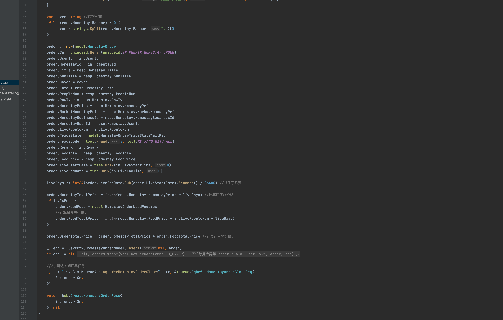
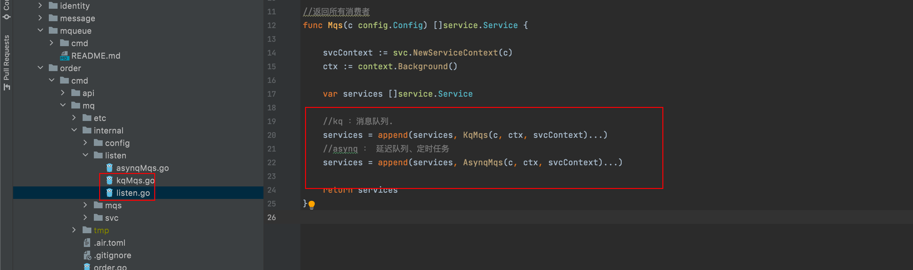
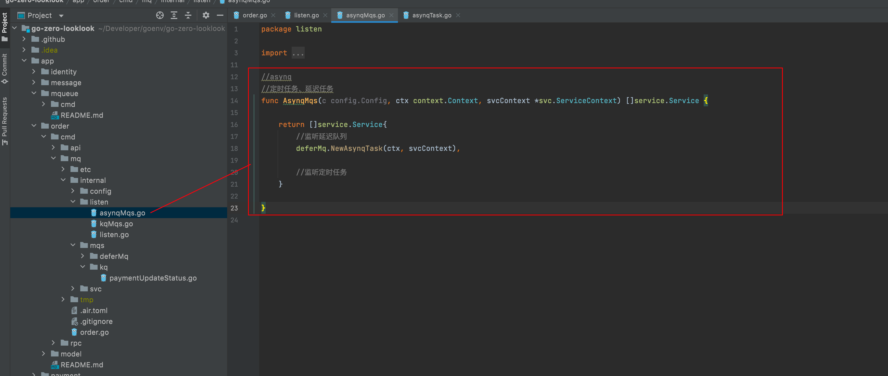
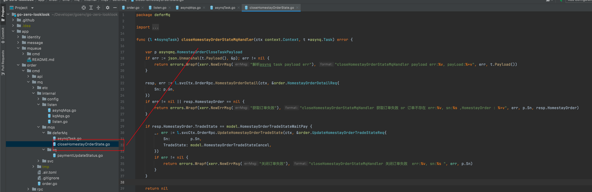

### VI. Order Service

This project address : https://github.com/Mikaelemmmm/go-zero-looklook


#### 1. Order service business architecture diagram


#### 2. Dependencies

order-api (order-api) Dependencies order-rpc (order-rpc), payment-rpc (payment-rpc)

payment-rpc (payment-rpc) depends on mqueue-rpc (message queue)

order-rpc (order-rpc) depend on mqueue-rpc (message queue), travel-rpc (B&B rpc)


#### 3. Order examples

##### 3.1 Placing an order

1, the user in the travel service to browse the B&B homestay to choose the date to place an order, call the order api interface

app/order/cmd/api/desc/order.api

```protobuf
//order module v1 interface
@server(
   prefix: order/v1
   group: homestayOrder
)
service order {
   
   @doc "Create Homestay Order"
   @handler createHomestayOrder
   post /homestayOrder/createHomestayOrder (CreateHomestayOrderReq) returns (CreateHomestayOrderResp)
   
   .....
}
```


2, order-api call order-rpc


3, after the creation of orders in rpc check conditions,   will call mqueue-rpc to create a message queue for delayed order closure



4, mqueue-rpc delayed queue in the code , delayed queue is used asynq, asynq is based on redis high-performance queue, while supporting message queues, timing queues, fixed-cycle queues, but our project in order to demonstrate go-zero official message queue go-queue (go-queue is based on kafka), so the message queue with go-queue, delayed queue, timing tasks with asynq. Here note that this is only to add delayed tasks to the delayed queue, the specific implementation is no longer here, then we go to see the specific implementation of the code after 20 minutes, in app/order/cmd/mq


5, let's look at the specific implementation of 20 minutes after the delayed pair of columns, in app/order/cmd/mq, here I want to explain, go-zero official goctl support for the generation of services is currently api, rpc, at the moment there is no support for console, mq, etc., but go-zero provides serviceGroup, convenient We manage any of our own services, so I used serviceGroup to manage the services in mq, which is also the official recommended way to use, the code is as follows:


1) app/order/cmd/mq/order.go First we look at main.go

```go
func main() {
	flag.Parse()
	var c config.

	conf.MustLoad(*configFile, &c)
  
	// log, prometheus, trace, metricsUrl.
	if err := c.SetUp(); err ! = nil {
		panic(err)
	}

	serviceGroup := service.NewServiceGroup()
	defer serviceGroup.Stop()

	for _, mq := range listen.Mqs(c) {
		serviceGroup.Add(mq)
	}
	serviceGroup.Start()
}
```

The serviceGroup can add any service to it, but how does it become a service? Then you have to implement two methods a Starter, a Stoper


2) We can see the loop listen.Mqs(c) in main, so let's see what listen.Mqs(c) has



We not only want to listen to asynq's delayed queue, timing queue, later we also want to listen to go-queue's kafka message queue, in the code we consider not want to put go-queue's kafka message queue and asynq's delayed queue, timing queue together, so here is a classification

3) asyny's delayed message queue

Define asynq



Define Routing


Specific implementation logic (closing order logic)



So we start this order-mq, asynq will be loaded, define the route, when we previously added the delayed queue to 20 minutes, will automatically execute the order closure logic, if the order is not paid, here will close the order, paid ignored, so that you can close the order without using the timed task rotation, ha ha


##### 3.2 Order List

There is no logic, just check out the display, just look at it yourself

```protobuf
//Order module v1 interface
@server(
   prefix: order/v1
   group: homestayOrder
)
service order {

   @doc "User order list"
   @handler userHomestayOrderList
   post /homestayOrder/userHomestayOrderList (UserHomestayOrderListReq) returns (UserHomestayOrderListResp)
   
}
```


##### 3.3 Order details

There is no logic, just check out the display, just look at it yourself

```protobuf
//Order module v1 interface
@server(
	prefix: order/v1
	group: homestayOrder
)
service order {

	@doc "User order details"
	@handler userHomestayOrderDetail
	post /homestayOrder/userHomestayOrderDetail (UserHomestayOrderDetailReq) returns (UserHomestayOrderDetailResp)
}
```


#### 4. Closing

After placing an order, of course we have to pay for it, so let's see the next payment service


