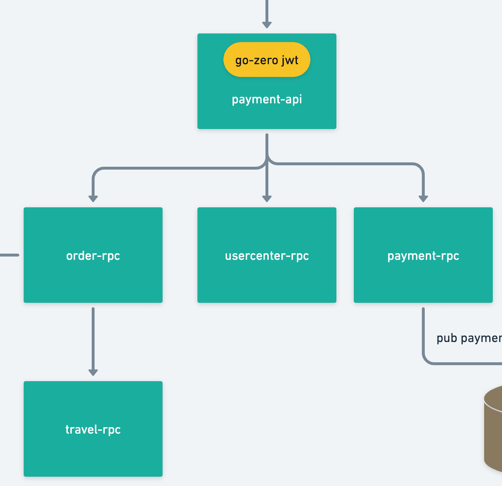
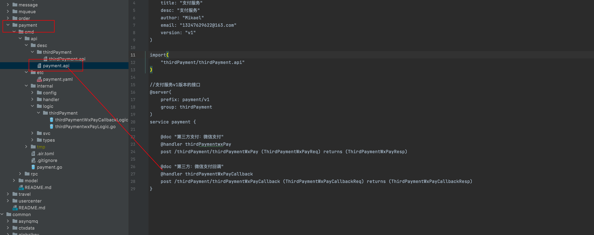
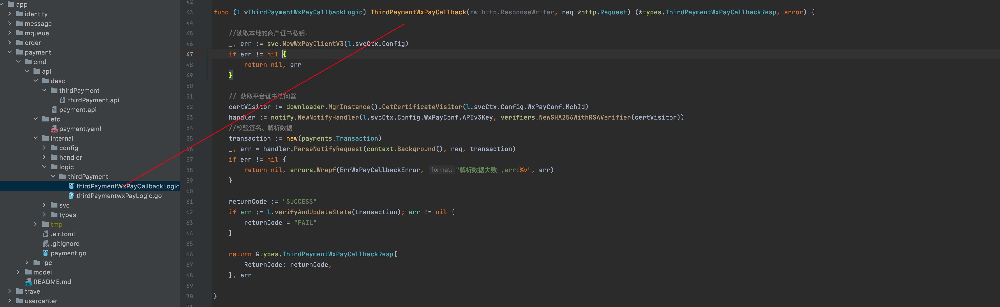
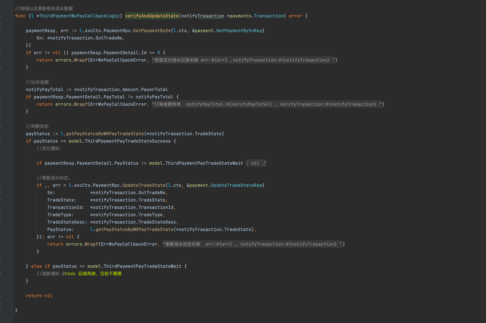

<h1>Table of Contents</h1>

- [VII. Payment services](#vii-payment-services)
  - [1. Payment service business architecture diagram](#1-payment-service-business-architecture-diagram)
  - [2. Dependencies](#2-dependencies)
  - [3. WeChat payment example](#3-wechat-payment-example)
    - [3.1. Create payment preprocessing order](#31-create-payment-preprocessing-order)
    - [3.2. WeChat payment callback](#32-wechat-payment-callback)
    - [3.3. Payment success send small program template message](#33-payment-success-send-small-program-template-message)
  - [4. Conclusion](#4-conclusion)

# VII. Payment services

This project address : <https://github.com/Mikaelemmmm/go-zero-looklook>

## 1. Payment service business architecture diagram



## 2. Dependencies

payment-api Dependencies order-rpc, payment-rpc, usercenter

order-rpc (order-rpc) depend on travel-rpc

## 3. WeChat payment example

### 3.1. Create payment preprocessing order

1. After creating an order on our side, the user has to go to the WeChat side to create a prepayment order

app/payment/cmd/api/desc/payment.api

```protobuf
//interface for payment service v1
@server(
 prefix: payment/v1
 group: thirdPayment
)
service payment {

 @doc "Third party payment: wechat payment"
 @handler thirdPaymentwxPay
 post /thirdPayment/thirdPaymentWxPay (ThirdPaymentWxPayReq) returns (ThirdPaymentWxPayResp)

 ...
}
```

app/payment/cmd/api/internal/logic/thirdPayment/thirdPaymentwxPayLogic.go----->ThirdPaymentwxPay

See the figure below, we did a encapsulation when we created the WeChat prepayment order, because our platform subsequent payment business is certainly not only B&B payment orders, there will certainly be others, such as we can subsequently launch the mall, launch courses, etc., so here we use switch to do a business classification, at present we only have B&B orders, but except for the query business is different, the other are the same, we put the same We encapsulate the same logic, so we continue to look at the encapsulated method createWxPrePayOrder


app/payment/cmd/api/internal/logic/thirdPayment/thirdPaymentwxPayLogic.go----->createWxPrePayOrder

Here is to get the user's login userId to exchange openid (this piece of our previous registration login where there is an applet registration login, then get the openid), then call paymentRpc in CreatePayment to create our local payment flow single number, in by calling WeChat sdk-> svc. NewWxPayClientV3 (here I wrapped it once based on go-zero, nothing difficult to understand).

Then create a prepayment order associated with our local bill number on the WeChat side, return to the front end, the front section through js to initiate the request can


### 3.2. WeChat payment callback

The front end takes the WeChat preprocessing order we give to initiate payment, and after the user enters the password to pay successfully, the WeChat server will call back to our server, the callback address is filled in our configuration


This callback address, must fill in our payment api service callback processing method, that is, the following figure of the interface, so that we can receive the WeChat callback in, we can do subsequent processing.



After the WeChat callback comes back, we have to handle the callback logic, we have to call verifyAndUpdateState to change our flowing bill number to paid



Let's take a look at verifyAndUpdateState method, we want to query whether the single number exists, compare the amount returned by the callback with the amount created when the amount is the same to update the flowing single number. No need to verify the signature here, the previous step of the sdk has done the processing



Here you have to write a training interface to the front-end, the front-end user payment success after the front-end can not be the front-end WeChat return results shall prevail, to be provided by the back-end interface training, to determine whether the flow list is really the back-end return to pay the successful state, if the interface returns success to be considered successful, WeChat front-end return can not be used as the basis, because WeChat front-end return is not safe, the general development are understood not to know their own google.

### 3.3. Payment success send small program template message

We pay callback success, will send the user an entry code, go to the merchant to show this code, the merchant through the background verification code, in fact, is the United States Mission look, we go to the United States Mission to place an order, the United States Mission will give you a code, the user take this code to check in or consumption, etc..

ok, callback success, we will call pyamentRpc to modify the current flow single state success


Let's see what's done in paymentRpc,go-zero-looklook/app/payment/cmd/rpc/internal/logic/updateTradeStateLogic.go

```go

func (l *UpdateTradeStateLogic) UpdateTradeState(in *pb.UpdateTradeStateReq) (*pb.UpdateTradeStateResp, error) {

 .....

 //3.update .
 thirdPayment.TradeState = in.TradeState
 thirdPayment.TransactionId = in.TransactionId
 thirdPayment.TradeType = in.TradeType
 thirdPayment.TradeStateDesc = in.TradeStateDesc
 thirdPayment.PayStatus = in.PayStatus
 thirdPayment.PayTime = time.Unix(in.PayTime, 0)
 if err := l.svcCtx.ThirdPaymentModel.UpdateWithVersion(l.ctx,nil, thirdPayment); err != nil {
  return nil, errors.Wrapf(xerr.NewErrCode(xerr.DB_ERROR), " UpdateTradeState UpdateWithVersion db  err:%v ,thirdPayment : %+v , in : %+v", err,thirdPayment,in)
 }

 //4.notify  sub "payment-update-paystatus-topic"  services(order-mq ..), pub.sub use kq
 if err:=l.pubKqPaySuccess(in.Sn,in.PayStatus);err != nil{
  logx.WithContext(l.ctx).Errorf("l.pubKqPaySuccess : %+v",err)
 }

 return &pb.UpdateTradeStateResp{}, nil
}


```

The core does two things, the first is to update the payment status, the second sends a message to the message queue (kafka), we look at the corresponding code in the message queue

```go
func (l *UpdateTradeStateLogic) pubKqPaySuccess(orderSn string,payStatus int64) error{

 m := kqueue.ThirdPaymentUpdatePayStatusNotifyMessage{
  OrderSn:  orderSn ,
  PayStatus: payStatus,
 }

 body, err := json.Marshal(m)
 if err != nil {
  return errors.Wrapf(xerr.NewErrMsg("kq UpdateTradeStateLogic pushKqPaySuccess task marshal error "), "kq UpdateTradeStateLogic pushKqPaySuccess task marshal error  , v : %+v", m)
 }

 return  l.svcCtx.KqueuePaymentUpdatePayStatusClient.Push(string(body))
}


```

You can see that we used go-queue to send a kq message to kafka, not asynq delayed message (although asynq also supports message queue I just want to demonstrate how to use go-queue on this feature), because we want to let all subscribed to the payment status of the business can receive this message and do the corresponding processing, although at present we only have a local listener to do the processing (send the applet template message to notify users of successful payment), so here is to send a payment flow related information to the kafka, here with the previous order there is the same just add the message to the queue, no processing, then we look at how to handle in order-mq.

go-zero-looklook/app/order/cmd/mq/internal/mqs/kq/paymentUpdateStatus.go

```go
package kq

....

func (l *PaymentUpdateStatusMq) Consume(_, val string) error {

 var message kqueue.ThirdPaymentUpdatePayStatusNotifyMessage
 if err := json.Unmarshal([]byte(val), &message); err != nil {
  logx.WithContext(l.ctx).Error("PaymentUpdateStatusMq->Consume Unmarshal err : %v , val : %s", err, val)
  return err
 }

 if err := l.execService(message); err != nil {
  logx.WithContext(l.ctx).Error("PaymentUpdateStatusMq->execService  err : %v , val : %s , message:%+v", err, val, message)
  return err
 }

 return nil
}

func (l *PaymentUpdateStatusMq) execService(message kqueue.ThirdPaymentUpdatePayStatusNotifyMessage) error {

 orderTradeState := l.getOrderTradeStateByPaymentTradeState(message.PayStatus)
 if orderTradeState != -99 {
  //update homestay order state
  _, err := l.svcCtx.OrderRpc.UpdateHomestayOrderTradeState(l.ctx, &order.UpdateHomestayOrderTradeStateReq{
   Sn:         message.OrderSn,
   TradeState: orderTradeState,
  })
  if err != nil {
   return errors.Wrapf(xerr.NewErrMsg("update homestay order state fail"), "update homestay order state fail err : %v ,message:%+v", err, message)
  }
 }

 return nil
}
....


```

Let's look at order-rpc's UpdateHomestayOrderTradeState

```go

// Update homestay order status
func (l *UpdateHomestayOrderTradeStateLogic) UpdateHomestayOrderTradeState(in *pb.UpdateHomestayOrderTradeStateReq) (*pb.UpdateHomestayOrderTradeStateResp, error) {

 ......

 // 3.Pre-update status judgment.
 homestayOrder.TradeState = in.TradeState
 if err := l.svcCtx.HomestayOrderModel.UpdateWithVersion(l.ctx,nil, homestayOrder); err != nil {
  return nil, errors.Wrapf(xerr.NewErrMsg("Failed to update homestay order status"), "Failed to update homestay order status db UpdateWithVersion err:%v , in : %v", err, in)
 }

 //4.notify user
 if in.TradeState == model.HomestayOrderTradeStateWaitUse {
  payload, err := json.Marshal(jobtype.PaySuccessNotifyUserPayload{Order: homestayOrder})
  if err != nil {
   logx.WithContext(l.ctx).Errorf("pay success notify user task json Marshal fail, err :%+v , sn : %s",err,homestayOrder.Sn)
  }else{
   _, err := l.svcCtx.AsynqClient.Enqueue(asynq.NewTask(jobtype.MsgPaySuccessNotifyUser, payload))
   if err != nil {
    logx.WithContext(l.ctx).Errorf("pay success notify user  insert queue fail err :%+v , sn : %s",err,homestayOrder.Sn)
   }
  }
 }


......
}


```

The main thing is to change the order status and send an asynq to the mqueue-job queue, so that mqueue-job sends a WeChat applet template message to the user

go-zero-looklook/app/mqueue/cmd/job/internal/logic/paySuccessNotifyUser.go

```go

func (l *PaySuccessNotifyUserHandler) ProcessTask(ctx context.Context, t *asynq.Task) error {

 var p jobtype.PaySuccessNotifyUserPayload
 if err := json.Unmarshal(t.Payload(), &p); err != nil {
  return errors.Wrapf(ErrPaySuccessNotifyFail, "PaySuccessNotifyUserHandler payload err:%v, payLoad:%+v", err, t.Payload())
 }

 // 1.get user openid
 usercenterResp, err := l.svcCtx.UsercenterRpc.GetUserAuthByUserId(ctx, &usercenter.GetUserAuthByUserIdReq{
  UserId:   p.Order.UserId,
  AuthType: usercenterModel.UserAuthTypeSmallWX,
 })
 if err != nil {
  return errors.Wrapf(ErrPaySuccessNotifyFail,"pay success notify user fail, rpc get user err:%v , orderSn:%s , userId:%d",err,p.Order.Sn,p.Order.UserId)
 }
 if usercenterResp.UserAuth == nil || len(usercenterResp.UserAuth.AuthKey) == 0 {
  return errors.Wrapf(ErrPaySuccessNotifyFail,"pay success notify user , user no exists err:%v , orderSn:%s , userId:%d",err,p.Order.Sn,p.Order.UserId)
 }
 openId := usercenterResp.UserAuth.AuthKey


 // 2.send notify
 msgs := l.getData(ctx,p.Order,openId)
 for _, msg := range msgs  {
  l.SendWxMini(ctx,msg)
 }

 return nil
}
```

## 4. Conclusion

Here basically the overall project service logic are almost finished, the follow-up will introduce the collection of logs, monitoring, deployment, etc.
