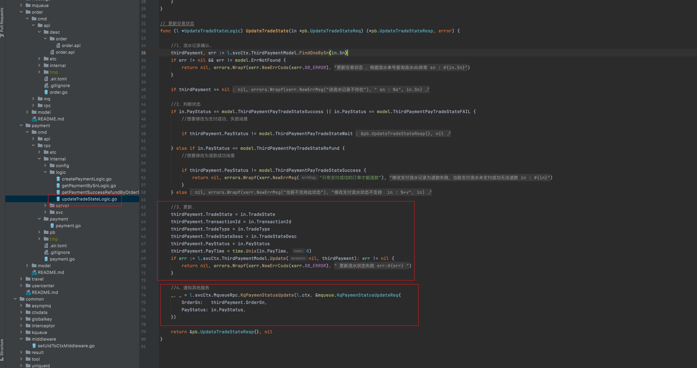
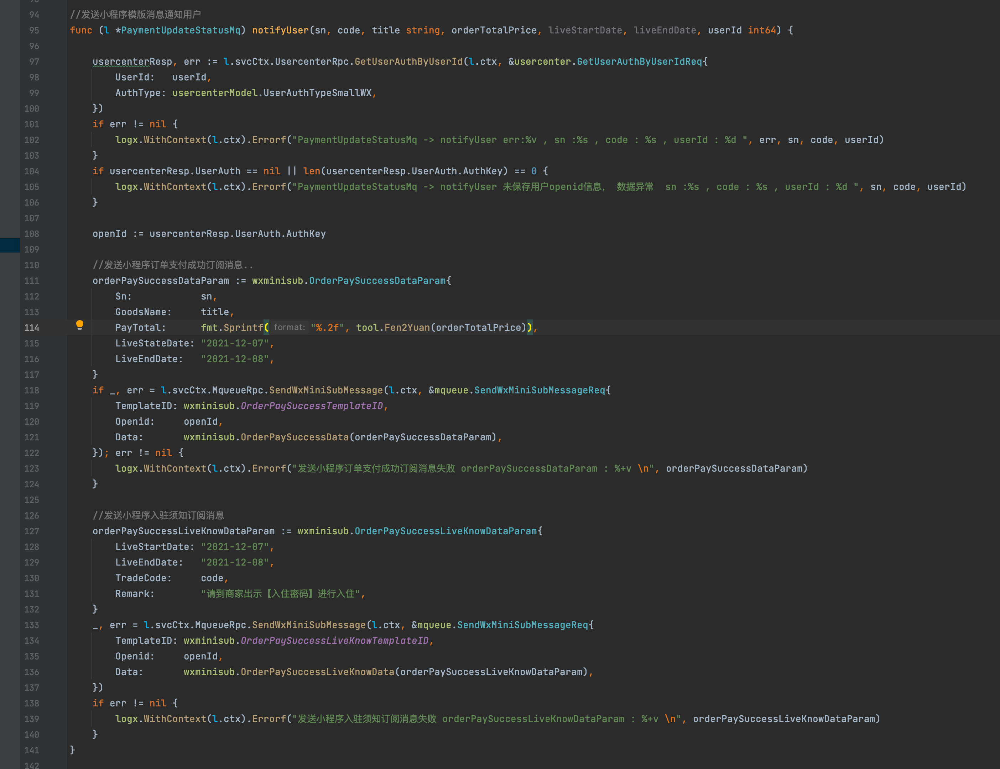
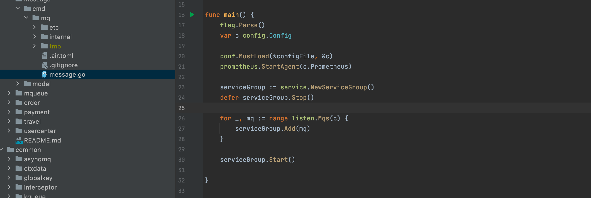

### VII. Payment services

This project address : https://github.com/Mikaelemmmm/go-zero-looklook


#### 1. Payment service business architecture diagram


#### 2. Dependencies

payment-api (payment api) Dependencies order-rpc (order-rpc), payment-rpc (payment-rpc), usercenter (user-rpc)

payment-rpc (payment-rpc) dependency mqueue-rpc (message queue)

order-rpc (order-rpc) depend on mqueue-rpc (message queue), travel-rpc

usercenter (user rpc) relies on identity-rpc (authorization authentication rpc)


#### 3. WeChat payment example

##### 3.1 Create payment preprocessing order

1. After creating an order on our side, the user has to go to the WeChat side to create a prepayment order

app/payment/cmd/api/desc/payment.api

```protobuf
//interface for payment service v1
@server(
	prefix: payment/v1
	group: thirdPayment
)
service payment {
	
	@doc "Third party payment: wechat payment"
	@handler thirdPaymentwxPay
	post /thirdPayment/thirdPaymentWxPay (ThirdPaymentWxPayReq) returns (ThirdPaymentWxPayResp)
	
	...
}
```


app/payment/cmd/api/internal/logic/thirdPayment/thirdPaymentwxPayLogic.go----->ThirdPaymentwxPay

See the figure below, we did a encapsulation when we created the WeChat prepayment order, because our platform subsequent payment business is certainly not only B&B payment orders, there will certainly be others, such as we can subsequently launch the mall, launch courses, etc., so here we use switch to do a business classification, at present we only have B&B orders, but except for the query business is different, the other are the same, we put the same We encapsulate the same logic, so we continue to look at the encapsulated method createWxPrePayOrder


app/payment/cmd/api/internal/logic/thirdPayment/thirdPaymentwxPayLogic.go----->createWxPrePayOrder

Here is to get the user's login userId to exchange openid (this piece of our previous registration login where there is an applet registration login, then get the openid), then call paymentRpc in CreatePayment to create our local payment flow single number, in by calling WeChat sdk-> svc. NewWxPayClientV3 (here I wrapped it once based on go-zero, nothing difficult to understand).

Then create a prepayment order associated with our local bill number on the WeChat side, return to the front end, the front section through js to initiate the request can


##### 3.2 WeChat payment callback

The front end takes the WeChat preprocessing order we give to initiate payment, and after the user enters the password to pay successfully, the WeChat server will call back to our server, the callback address is filled in our configuration


This callback address, must fill in our payment api service callback processing method, that is, the following figure of the interface, so that we can receive the WeChat callback in, we can do subsequent processing.


After the WeChat callback comes back, we have to handle the callback logic, we have to call verifyAndUpdateState to change our flowing bill number to paid 


Let's take a look at verifyAndUpdateState method, we want to query whether the single number exists, compare the amount returned by the callback with the amount created when the amount is the same to update the flowing single number. No need to verify the signature here, the previous step of the sdk has done the processing


Here you also have to write a rotation interface to the front-end, the front-end user payment success after the front-end can not be based on the results returned by the front-end WeChat, to be provided by the back-end interface rotation, to determine whether this flowing list is really the back-end to return a successful state of payment, if the interface returns success to be considered successful, WeChat front-end return can not be used as a basis, because WeChat front-end return is not safe, the general development are understood not to know Baidu yourself.


##### 3.3 payment success send small program template message

We pay callback success, will send the user an entry code, go to the merchant to show this code, the merchant through the background verification code, in fact, is the same as the American group, we go to the American group to place an order, the American group will give you a code, the user takes this code to check in or consumption, etc..

ok, callback success, we will call pyamentRpc to modify the current flow single state success


Let's see what is done in paymentRpc.



The first is a check, the core does two things, the first is to update the status, the second sends a message to the message queue, we look at the corresponding code in the message queue


You can see that we used go-queue to send a kq message to kafka, not asynq delayed message, because we want all subscribed to the payment status of the business can receive this message to do the corresponding processing, although at present we only have a place to listen to do processing (send a small program template message to notify users of successful payment), so here is to send a payment flow related information to kafka, here with the previous order there is the same just add the message to the queue, no processing, then we look at the order-mq in how to handle.


The previous section of order has introduced the whole order-mq operation mechanism, so we won't say more here, we will only talk about kq here

When order-mq is started, go-queue will listen for messages in kafka


Consume will receive the message from kafka and then deserialize the data and pass it to the execService to perform specific operations. What is executed in the execService?

As you can see in the red box below, one is to modify the order status (non-payment status, the order also has its own status), one is to send a message (SMS, WeChat applet template message) to the user

app/order/cmd/mq/internal/mqs/kq/paymentUpdateStatus.go


Modify the order state we do not see, we can look at sending small program template message, below LiveStateDate \ LiveEndDate before debugging write dead, this directly into the method passed over the time is good, convert it

Note] users want to receive the small program template message, you must let the user authorization in the front end to do, this is a small program must not we can control




Here to send messages we also do not really call the WeChat sdk to send messages, but also to the message queue MqueueRpc insert template messages (in fact, here can also send directly), and then by the message message service from the kafka to really send, is to want all the SMS, email, WeChat and other messages from this service to send out, this own according to The company's own business or architecture to design it flexibly, it does not have to be so.

So, let's go straight to the message service code


There is only one mq in the message business, because he does not need rpc, api, only need to send messages from the queue regularly, so it runs the same logic as order-mq, the same applies to serviceGroup management



We do not go into detail, run the logic to see the order service section of the order-mq has a detailed description, we only look at the specific implementation of the logic, go-queue from the kafka queue to send each WeChat small program template message data, and then deserialized to the execService to handle, let's look at the execService


execService is mainly the integration of data, sent to the applet through the client of the applet sdk, there is a point of attention here, the applet can distinguish between the environment, is sent to the online applet or experience version of the applet, in the red box below to make a distinction, the actual so is not safe Through this way, it is best to get to the configuration file, in case the development environment someone messed up to change into the formal, randomly sent to others openid on the accident, this can change themselves ha


#### 4、Conclusion

Here basically the overall project service logic are almost finished, the follow-up will introduce the collection of logs, monitoring, deployment, etc.


