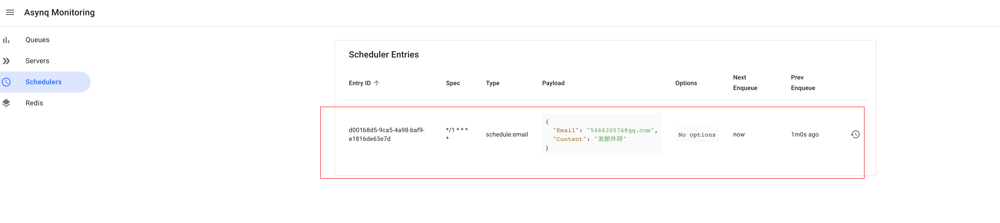
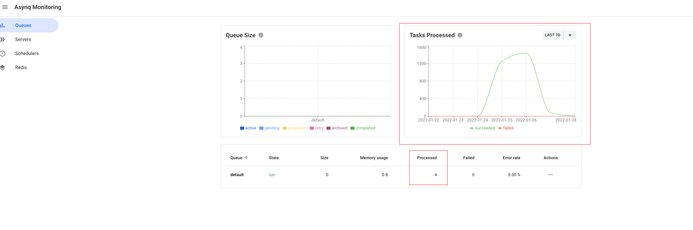

<h1>Table of Contents</h1>

  - [VIII. Messages, Delays, Timed Queues](#viii-messages-delays-timed-queues)
    - [1. Overview](#1-overview)
    - [2. How to use](#2-how-to-use)
      - [2.1. main](#21-main)
      - [2.2. mq category management](#22-mq-category-management)
      - [2.3. Actual business](#23-actual-business)
        - [2.3.1 Delayed Queues](#231-delayed-queues)
        - [2.3.2 kq message queue](#232-kq-message-queue)
    - [3. Timed tasks](#3-timed-tasks)
    - [4. Conclusion](#4-conclusion)

## VIII. Messages, Delays, Timed Queues

This project address : <https://github.com/Mikaelemmmm/go-zero-looklook>

### 1. Overview

There are many kinds of message queues, there are rabbitmq, rocketmq, kafka and other common ones, of which go-queue (<https://github.com/zeromicro/go-queue>) is the official message queue component developed by go-zero, which is divided into 2 categories, one is kq, one is dq, kq is kq is a kafka-based message queue, dq is a beanstalkd-based delayed queue, but go-queue does not support timed tasks. Specific want to know more about go-queue I also wrote a tutorial before you can go to see here not to elaborate.

The project uses go-queue to do the message queue, asynq to do the delayed queue, timing queue

Why use asynq for several reasons

- directly based on redis, general projects have redis, and asynq itself is based on redis so you can maintain a middleware less
- Support message queues, delayed queues, timed task scheduling, because you want the project to support timed tasks and asynq directly support
- webui interface, each task can be suspended, archived, through the ui interface to view the success and failure, monitoring

Why asynq support message queue is still using go-queue?

- kafka throughput is famous for its performance, if the initial volume is not large, you can directly use asynq
- No purpose, just want to give you a demonstration of go-queue

In our use of go-zero, goctl brought us a lot of convenience, but at present go-zero only generate api, rpc, many students in the group asked how to generate timed tasks, delayed queues, message queues, directory structure how to do, in fact go-zero is designed for us, is serviceGroup, use use serviceGroup to manage your services.

### 2. How to use

In the previous orders, messages and other scenarios we have actually demonstrated, here in an additional separate supplement once

We still take order-mq for example, obviously using goctl to generate api, rpc is not what we want, then we will use serviceGroup transformation, the directory structure or the continuation of the api is basically the same, only the handler changed to listen, the logic replaced by mqs.

#### 2.1. main

```go
var configFile = flag.String("f", "etc/order.yaml", "Specify the config file")

func main() {
 flag.Parse()
 var c config.Config

 conf.MustLoad(*configFile, &c)

 // log.prometheus.trace.metricsUrl.
 if err := c.SetUp(); err != nil {
  panic(err)
 }

 serviceGroup := service.NewServiceGroup()
 defer serviceGroup.Stop()

 for _, mq := range listen.Mqs(c) {
  serviceGroup.Add(mq)
 }

 serviceGroup.Start()
}

```

- First we have to define the configuration as well as parse the configuration.

- Secondly, why do we need to add SetUp here and api, rpc do not need it? Because api, rpc are in MustNewServer has been written in the framework, but we use serviceGroup management did not, you can manually point in SetUp to see, this method contains the definition of log, prometheus, trace, metricsUrl, a method can save a lot of things, so we directly modify the configuration file can achieve logging, monitoring, link tracking.

- Next is the go-zero serivceGroup management service, serviceGroup is used to manage a group of service, that service is actually an interface, the code is as follows

  Service (code in go-zero/core/service/servicegroup.go)

  ```golang
  // Service is the interface that groups Start and Stop methods.
   Service interface {
    Starter //Start
    Stopper //Stop
   }
  ```

  So, as long as your service implements these 2 interfaces, it can be added to the serviceGroup unified management

  Then you can see that we implement all the mqs in this interface, and then put them all in the list.Mqs, and start the service

#### 2.2. mq category management

go-zero-looklook/app/order/cmd/mq/internal/listen directory code

The code in this directory is to unify the management of different types of mq, because we want to manage kq, asynq and probably rabbitmq, rocketmq, etc., so we do the classification here for easy maintenance

The unified management in go-zero-looklook/app/order/cmd/mq/internal/listen/listen.go, then in the main call listen.Mqs can get all mq together start

```go
//return all consumers
func Mqs(c config.Config) []service.Service {

 svcContext := svc.NewServiceContext(c)
 ctx := context.Background()

 var services []service.Service

 //kq
 services = append(services, KqMqs(c, ctx, svcContext)...)
 //asynq
 services = append(services, AsynqMqs(c, ctx, svcContext)...)
 //other mq ....

 return services
}
```

go-zero-looklook/app/order/cmd/mq/internal/listen/asynqMqs.go is the defined asynq

```go
//asynq
func AsynqMqs(c config.Config, ctx context.Context, svcContext *svc.ServiceContext) []service.Service {

   return []service.Service{

      deferMq.NewAsynqTask(ctx, svcContext),

   }

}
```

go-zero-looklook/app/order/cmd/mq/internal/listen/asynqMqs.go is the defined kq (kafka for go-queue)

```go
//kq
func KqMqs(c config.Config, ctx context.Context, svcContext *svc.ServiceContext) []service.Service {

 return []service.Service{
  kq.MustNewQueue(c.PaymentUpdateStatusConf, kqMq.NewPaymentUpdateStatusMq(ctx, svcContext)),
  //.....
 }

}
```

#### 2.3. Actual business

To write the actual business, we'll go under go-zero-looklook/app/order/cmd/mq/internal/listen/mqs, which is also categorized here for easy maintenance

- deferMq : delayed queue
- kq : message queue

##### 2.3.1 Delayed Queues

```go

type AsynqTask struct {
   ctx    context.Context
   svcCtx *svc.ServiceContext
}

func NewAsynqTask(ctx context.Context, svcCtx *svc.ServiceContext) *AsynqTask {
   return &AsynqTask{
      ctx:    ctx,
      svcCtx: svcCtx,
   }
}

func (l *AsynqTask) Start() {

   fmt.Println("AsynqTask start ")

   srv := asynq.NewServer(
      asynq.RedisClientOpt{Addr: l.svcCtx.Config.Redis.Host, Password: l.svcCtx.Config.Redis.Pass},
      asynq.Config{
         Concurrency: 10,
         Queues: map[string]int{
            "critical": 6,
            "default":  3,
            "low":      1,
         },
      },
   )

   mux := asynq.NewServeMux()

   //close room order
   mux.HandleFunc(asynqmq.TypeHomestayOrderCloseDelivery, l.closeHomestayOrderStateMqHandler)

   if err := srv.Run(mux); err != nil {
      log.Fatalf("could not run server: %v", err)
   }
}

func (l *AsynqTask) Stop() {
   fmt.Println("AsynqTask stop")
}
```

Because asynq has to be started first, then define the routing task, all we do in asynqTask.go unified routing management, after we each business in the deferMq folder under the definition of a separate file (such as "delayed closure of orders: closeHomestayOrderState.go "), so that each business a file, with go-zero api, rpc logic, maintenance is very convenient

closeHomestayOrderState.go Close order logic

```go
package deferMq

import (
 "context"
 "encoding/json"
 "looklook/app/order/cmd/rpc/order"
 "looklook/app/order/model"
 "looklook/common/asynqmq"
 "looklook/common/xerr"

 "github.com/hibiken/asynq"
 "github.com/pkg/errors"
)

func (l *AsynqTask) closeHomestayOrderStateMqHandler(ctx context.Context, t *asynq.Task) error {

 var p asynqmq.HomestayOrderCloseTaskPayload
 if err := json.Unmarshal(t.Payload(), &p); err != nil {
  return errors.Wrapf(xerr.NewErrMsg("Parse asynq task payload err"), "closeHomestayOrderStateMqHandler payload err:%v, payLoad:%+v", err, t.Payload())
 }

 resp, err := l.svcCtx.OrderRpc.HomestayOrderDetail(ctx, &order.HomestayOrderDetailReq{
  Sn: p.Sn,
 })
 if err != nil || resp.HomestayOrder == nil {
  return errors.Wrapf(xerr.NewErrMsg("Failed to get order"), "closeHomestayOrderStateMqHandler Failure to get orders or The order does not exist err:%v, sn:%s ,HomestayOrder : %+v", err, p.Sn, resp.HomestayOrder)
 }

 if resp.HomestayOrder.TradeState == model.HomestayOrderTradeStateWaitPay {
  _, err := l.svcCtx.OrderRpc.UpdateHomestayOrderTradeState(ctx, &order.UpdateHomestayOrderTradeStateReq{
   Sn:         p.Sn,
   TradeState: model.HomestayOrderTradeStateCancel,
  })
  if err != nil {
   return errors.Wrapf(xerr.NewErrMsg("Close the order failed"), "closeHomestayOrderStateMqHandler Close the order failed  err:%v, sn:%s ", err, p.Sn)
  }
 }

 return nil
}
```

##### 2.3.2 kq message queue

Look under the go-zero-looklook/app/order/cmd/mq/internal/mqs/kq folder, because kq is not quite the same as asynq, it is itself managed using go-zero's Service, which has implemented the starter, stopper interface, so we add it to the / Users/seven/Developer/goenv/go-zero-looklook/app/order/cmd/mq/internal/listen/kqMqs.go to define a go-queue service directly to the serviceGroup and give it to main to start. Our business code only needs to implement go-queue's Consumer to write our own business directly.

1) /Users/seven/Developer/goenv/go-zero-looklook/app/order/cmd/mq/internal/listen/kqMqs.go

```go
func KqMqs(c config.Config, ctx context.Context, svcContext *svc.ServiceContext) []service.Service {

 return []service.Service{
  kq.MustNewQueue(c.PaymentUpdateStatusConf, kqMq.NewPaymentUpdateStatusMq(ctx, svcContext)),
  //.....
 }
}
```

You can see that kq.MustNewQueue itself returns queue.MessageQueue, queue.MessageQueue also implements Start, Stop

2) In business

/Users/seven/Developer/goenv/go-zero-looklook/app/order/cmd/mq/internal/mqs/kq/paymentUpdateStatus.go

```go
func (l *PaymentUpdateStatusMq) Consume(_, val string) error {

 fmt.Printf(" PaymentUpdateStatusMq Consume val : %s \n", val)

 var message kqueue.ThirdPaymentUpdatePayStatusNotifyMessage
 if err := json.Unmarshal([]byte(val), &message); err != nil {
  logx.WithContext(l.ctx).Error("PaymentUpdateStatusMq->Consume Unmarshal err : %v , val : %s", err, val)
  return err
 }

 if err := l.execService(message); err != nil {
  logx.WithContext(l.ctx).Error("PaymentUpdateStatusMq->execService  err : %v , val : %s , message:%+v", err, val, message)
  return err
 }

 return nil
}
```

We only need to implement the interface Consume in paymentUpdateStatus.go to receive the kafka messages from kq, and we can just process our business in our Consumer

### 3. Timed tasks

About timed tasks, currently go-zero-looklook is not used, here I also explain

- If you want to keep it simple and use cron directly (bare metal, k8s are available).
- If a little more complex you can use <https://github.com/robfig/cron> Bag to define the time in the code
- Use xxl-job, gocron distributed timing task system access
- asynq's shedule

⚠️  Project specific look at app/mqueue/cmd/scheduler and app/mqueue/cmd/job

Here I'll demonstrate the asynq schedule

The client is used to define the scheduling time, the server is to accept the client's message trigger to execute the business we write, the actual business we should write in the server, the client is used to define the business scheduling time

asynqtest/docker-compose.yml

```yaml
version: '3'

services:

  #asynqmon asynq webui
  asynqmon:
    image: hibiken/asynqmon:latest
    container_name: asynqmon_asynq
    ports:
      - 8980:8080
    command:
      - '--redis-addr=redis:6379'
      - '--redis-password=G62m50oigInC30sf'
    restart: always
    networks:
      - asynqtest_net
    depends_on:
      - redis


  #redis
  redis:
    image: redis:6.2.5
    container_name: redis_asynq
    ports:
      - 63779:6379
    environment:
      TZ: Asia/Shanghai
    volumes:
      - ./data/redis/data:/data:rw
    command: "redis-server --requirepass G62m50oigInC30sf  --appendonly yes"
    privileged: true
    restart: always
    networks:
      - asynqtest_net


networks:
  asynqtest_net:
    driver: bridge
    ipam:
      config:
        - subnet: 172.22.0.0/16
```

asynqtest/shedule/client/client.go

```go
package main

import (
 "asynqtest/tpl"
 "encoding/json"
 "log"

 "github.com/hibiken/asynq"
)

const redisAddr = "127.0.0.1:63779"
const redisPwd = "G62m50oigInC30sf"

func main() {
 // scheduler
 scheduler := asynq.NewScheduler(
  asynq.RedisClientOpt{
   Addr:     redisAddr,
   Password: redisPwd,
  }, nil)

 payload, err := json.Marshal(tpl.EmailPayload{Email: "546630576@qq.com", Content: "Send an email"})
 if err != nil {
  log.Fatal(err)
 }

 task := asynq.NewTask(tpl.EMAIL_TPL, payload)
 entryID, err := scheduler.Register("*/1 * * * *", task)

 if err != nil {
  log.Fatal(err)
 }
 log.Printf("registered an entry: %q\n", entryID)

 if err := scheduler.Run(); err != nil {
  log.Fatal(err)
 }
}

```

asynqtest/shedule/server/server.go

```go
package main

import (
 "context"
 "encoding/json"
 "fmt"
 "log"

 "asynqtest/tpl"

 "github.com/hibiken/asynq"
)

func main() {
 srv := asynq.NewServer(
  asynq.RedisClientOpt{Addr: "127.0.0.1:63779", Password: "G62m50oigInC30sf"},
  asynq.Config{
   Concurrency: 10,
   Queues: map[string]int{
    "critical": 6,
    "default":  3,
    "low":      1,
   },
  },
 )

 mux := asynq.NewServeMux()

 //Close the homestay order task
 mux.HandleFunc(tpl.EMAIL_TPL, emailMqHandler)

 if err := srv.Run(mux); err != nil {
  log.Fatalf("could not run server: %v", err)
 }
}

func emailMqHandler(ctx context.Context, t *asynq.Task) error {

 var p tpl.EmailPayload
 if err := json.Unmarshal(t.Payload(), &p); err != nil {
  return fmt.Errorf("emailMqHandler err:%+v", err)
 }

 fmt.Printf("p : %+v \n", p)

 return nil

}

```

asynqtest/tpl/tpl.go

```go
package tpl

const EMAIL_TPL = "schedule:email"

type EmailPayload struct {
 Email   string
 Content string
}
```

Start server.go, client.go

You can see all the tasks defined by the client by typing <http://127.0.0.1:8980/schedulers>  in the browser



Enter <http://127.0.0.1:8990/> in your browser




Talk about asynq shedule in the integration of the project ideas, you can start a separate service as a scheduling client to define the system's timing task scheduling management, the server defined in each business own mq of asynq together can be.

### 4. Conclusion

In this section, we learned to use the message queue, delayed queue , kafka can be viewed through the management tools, as for asynq view webui in go-zero-looklook/docker-compose-env.yml we have started a good asynqmon, directly using <http://127.0>. 0.1:8980 can be viewed
